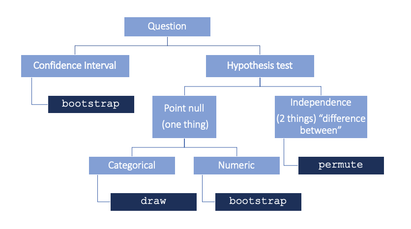

```{r setup, include=FALSE}
# load packages ----------------------------------------------------------------
library(kableExtra)
library(tidyverse)
library(infer)
library(grid)
library(gridExtra)
library(emo)
library(openintro)
library(janitor)
# knitr options ----------------------------------------------------------------
knitr::opts_chunk$set(fig.align = "center", 
                      fig.height = 3, 
                      fig.width = 5,
                      echo = FALSE, 
                      message = FALSE, 
                      warning = FALSE)
# data prep --------------------------------------------------------------------
# Read pre-permuted data
# gender_discrimination_big_perm <- readRDS("./data/gender_discrimination_big_perm.rds")
# gender_discrimination_big <- readRDS("./data/gender_discrimination_big.rds")
# gender_discrimination_new_perm <- readRDS("./data/gender_discrimination_new_perm.rds")
# gender_discrimination_new <- readRDS("./data/gender_discrimination_new.rds")
gender_discrimination_perm <- readRDS("./data/gender_discrimination_perm.rds")
# gender_discrimination_small_perm <- readRDS("./data/gender_discrimination_small_perm.rds")
# gender_discrimination_small <- readRDS("./data/gender_discrimination_small.rds")
# diff_orig <- gender_discrimination |>
#   group_by(gender) |>
#   summarize(prop_promoted = mean(decision == "promoted")) |>
#   summarize(stat = diff(prop_promoted)) |> 
#   pull()
#   
# diff_orig_small <- gender_discrimination_small |>
#   group_by(gender) |>
#   summarize(prop_promoted = mean(decision == "promoted")) |>
#   summarize(diff(prop_promoted)) |> 
#   pull()
# diff_orig_big <- gender_discrimination_big |>
#   group_by(gender) |>
#   summarize(prop_promoted = mean(decision == "promoted")) |>
#   summarize(diff(prop_promoted)) |> 
#   pull()
# diff_orig_new <- gender_discrimination_new |>
#   group_by(gender) |>
#   summarize(prop_promoted = mean(decision == "promoted")) |>
#   summarize(diff(prop_promoted)) |> 
#   pull()
```

## Completing a randomization test: gender discrimination

The example in this application exercise is taken from a paper on the *"Influence of sex role stereotypes on personnel decisions"* by Rosen and Jerdee, 1974.

Forty-eight male bank supervisors were given personnel files and asked to judge whether the person should be promoted to a branch manager position.
The files were all identical except that *half of them* indicated that the candidate was *male* and *the other half* indicated that the candidate was *female*.

The data were then collected showing that 14 out of the 24 female files were selected for promotion and 21 of the 24 male files were selected for promotion.

### The data

The data comes from the `gender_discrimination` dataset in the `openintro` package.

```{r}
gender_discrimination |>
  count(gender, decision) |>
  pivot_wider(names_from = decision, values_from = n) |>
  adorn_totals(where = c("row", "col")) |>
  kable(format = "html", escape = FALSE) |>
  kable_styling("striped", full_width = FALSE)
```

## Exercise 1

-   Using the `count()` function, tabulate the variables `gender` and `decision`.
-   Group the data by `gender`.
-   Calculate the proportion of those who were and were not promoted in each gender and call this variable `prop`.

```{r gender-promoted, eval = FALSE, echo = TRUE}
gender_discrimination |>
  count(___, ___) |>
  group_by(___) |>
  mutate(___ = ___ / ___)
```

A shortcut for only computing the two proportions we need is below:

```{r, echo = TRUE}
gender_discrimination |>
  group_by(gender) |>
  summarize(prop_promoted = mean(decision == "promoted"))
```

After summarizing the data, we can see 58.3% of the women were promoted whereas 87.5% of the men were promoted, with a difference of 29.2%.

Let's save this original (observed) difference into an object called `diff_orig`.
Note the code below makes use of a new function `diff()` that computes the lagged difference between elements in a vector.

```{r diff-orig, echo=TRUE}
diff_orig <- gender_discrimination |>
  group_by(gender) |>
  summarize(prop_promoted = mean(decision == "promoted")) |> 
  summarize(stat = diff(prop_promoted))

# See the result
diff_orig
```

Note, an alternative way of computing the `observe`d point estimate, is to use the `observe()` function from the `infer` package.

```{r, echo = TRUE}
gender_discrimination |> 
  observe(decision ~ gender, success = "promoted",
          stat = "diff in props")
```

### Random chance?

The important statistical question to ask after looking at the data is as follows: *is it plausible to observe such a difference in proportions in a scenario where men and women are equally likely to be promoted?*

That is to say, if we shuffle the data so that gender and promotion are not linked in any way, what sort of chance differences are observed?

In the first shuffle of the data, we see that 17 women were promoted and 18 men were promoted, a difference in proportions of -0.04.
Notice that the shuffled difference is closer to zero than the observed difference of -0.29.

*First shuffle*

```{r}
dt <- tibble(
  gender = c("female", "male", "Total"),
  not = c(7, 6, 13),
  promoted = c(17, 18, 35), Total = c(24, 24, 48)
) |>
  mutate(
    Total = ifelse(Total < 30,
      cell_spec(Total, color = openintro::COL[4, 1], bold = T),
      cell_spec(Total, color = "black")
    ),
    promoted = ifelse(promoted > 30,
      cell_spec(promoted, color = openintro::COL[4, 1], bold = T),
      cell_spec(promoted, color = "black")
    )
  )
kable(dt, format = "html", escape = F) |>
  kable_styling("striped", full_width = F, position = "float_left")
```

```{r}
randdiff <- data.frame(diff = c(17 / 24 - 18 / 24))
ggplot(randdiff) +
  geom_dotplot(aes(x = diff), binwidth = .05) +
  geom_vline(xintercept = 21 / 24 - 14 / 24, color = openintro::COL[4, 1], lwd = 1.3) +
  geom_vline(xintercept = -(21 / 24 - 14 / 24), color = openintro::COL[4, 1], lwd = 1.3) +
  xlab("Difference in Proportions") +
  theme(
    axis.title.y = element_blank(), axis.text.y.left = element_blank(),
    axis.ticks.y = element_blank(), panel.grid.major.y = element_blank(),
    panel.grid.minor = element_blank(), panel.grid.major.x = element_line()
  ) +
  scale_x_continuous(breaks = seq(-0.5, 0.5, 0.1), limits = c(-0.5, 0.5))
```

Keep in mind that a fixed number of male and female resumes were given out, 24 of each.
Additionally, assume that there were a fixed number of people allowed to be promoted, here 35.
However, the shuffling process breaks the relationship between gender and promotion decision, which allows us to understand the variability of the differences in promotion rates assuming there is no connection between the two variables.

Even though here gender doesn't play a role in determining promotion, we still typically don't have a difference of zero.
That's because of the natural variability associated with which manager gets which file.
But the point of the randomization process is to identify how different the proportions can be naturally and, on the other hand, how big a difference would have to be to make us think something unusual was going on.

By shuffling the promotion variable repeatedly, not only do we see the variability in the null differences, but we also see that the observed statistic of -0.29 is on the extreme end of the plausible values generated by natural variability.

```{r}
p1 <- gender_discrimination_perm |>
  head(5) |>
  ggplot() +
  geom_dotplot(aes(x = stat), binwidth = 0.03) +
  geom_vline(xintercept = 21 / 24 - 14 / 24, color = openintro::COL[4, 1], lwd = 1.3) +
  geom_vline(xintercept = -(21 / 24 - 14 / 24), color = openintro::COL[4, 1], lwd = 1.3) +
  xlab("Difference in Proportions") +
  theme(
    axis.title.y = element_blank(), axis.text.y.left = element_blank(),
    axis.ticks.y = element_blank(), panel.grid.major.y = element_blank(),
    panel.grid.minor = element_blank(), panel.grid.major.x = element_line()
  ) +
  scale_x_continuous(breaks = seq(-0.5, 0.5, 0.1), limits = c(-0.5, 0.5))
p2 <- gender_discrimination_perm |>
  head(10) |>
  ggplot() +
  geom_dotplot(aes(x = stat), binwidth = 0.03) +
  geom_vline(xintercept = 21 / 24 - 14 / 24, color = openintro::COL[4, 1], lwd = 1.3) +
  geom_vline(xintercept = -(21 / 24 - 14 / 24), color = openintro::COL[4, 1], lwd = 1.3) +
  xlab("Difference in Proportions") +
  theme(
    axis.title.y = element_blank(), axis.text.y.left = element_blank(),
    axis.ticks.y = element_blank(), panel.grid.major.y = element_blank(),
    panel.grid.minor = element_blank(), panel.grid.major.x = element_line()
  ) +
  scale_x_continuous(breaks = seq(-0.5, 0.5, 0.1), limits = c(-0.5, 0.5))
p3 <- gender_discrimination_perm |>
  head(20) |>
  ggplot() +
  geom_dotplot(aes(x = stat), binwidth = 0.03) +
  geom_vline(xintercept = 21 / 24 - 14 / 24, color = openintro::COL[4, 1], lwd = 1.3) +
  geom_vline(xintercept = -(21 / 24 - 14 / 24), color = openintro::COL[4, 1], lwd = 1.3) +
  xlab("Difference in Proportions") +
  theme(
    axis.title.y = element_blank(), axis.text.y.left = element_blank(),
    axis.ticks.y = element_blank(), panel.grid.major.y = element_blank(),
    panel.grid.minor = element_blank(), panel.grid.major.x = element_line()
  ) +
  scale_x_continuous(breaks = seq(-0.5, 0.5, 0.1), limits = c(-0.5, 0.5))
p4 <- gender_discrimination_perm |>
  head(50) |>
  ggplot() +
  geom_dotplot(aes(x = stat), binwidth = 0.03) +
  geom_vline(xintercept = 21 / 24 - 14 / 24, color = openintro::COL[4, 1], lwd = 1.3) +
  geom_vline(xintercept = -(21 / 24 - 14 / 24), color = openintro::COL[4, 1], lwd = 1.3) +
  xlab("Difference in Proportions") +
  theme(
    axis.title.y = element_blank(), axis.text.y.left = element_blank(),
    axis.ticks.y = element_blank(), panel.grid.major.y = element_blank(),
    panel.grid.minor = element_blank(), panel.grid.major.x = element_line()
  ) +
  scale_x_continuous(breaks = seq(-0.5, 0.5, 0.1), limits = c(-0.5, 0.5))
grid.arrange(p1, p2, p3, p4,
  ncol = 2, nrow = 2
)
```

### Randomizing gender discrimination

Recall that we are considering a situation where the number of men and women are fixed (representing the resumes) and the number of people promoted is fixed (the managers were able to promote only 35 individuals).

In this exercise, you'll create a randomization distribution of the null statistic with 1000 replicates.
As a reminder, the statistic of interest is the difference in proportions promoted between genders (i.e. proportion for males minus proportion for females).

**Using the specify-hypothesis-generate-calculate workflow in infer, you can calculate the same statistic, but instead of getting a single number, you get a whole distribution.** The goal is to compare that single number from the original dataset to the distribution resulting from the simulation.

## Exercise 2

Create a data frame of permuted differences in promotion rates.

-   Specify `decision` vs. `gender`. (`"promoted"` is considered success.)
-   Set the null hypothesis as `"independence"`.
-   Generate `1000` reps of type `"permute"`.
-   Calculate the summary stat `"diff in props"`.

```{r gender-discrimination-perm-1000, echo=TRUE, eval = FALSE}
# Create data frame of permuted differences in promotion rates
gender_discrimination_perm <- gender_discrimination |>
  # Specify decision vs. gender
  specify(___, success = "promoted") |>
  # Set null hypothesis as independence
  hypothesize(null = "___") |>
  # Generate 1000 permutations
  generate(reps = ___, type = "___") |>
  # Calculate difference in proportions
  calculate(stat = "___")
```

## Exercise 3

Draw a histogram of permuted differences.

-   Using the permutation dataset, `gender_discrimination_perm` (which we already calculated), plot the distribution of test statistics (`stat`).
-   Specify a histogram layer with `geom_histogram()`, where the `binwidth` is set to `0.01`.
-   Add a vertical line with `geom_vline()`, and specify the `xintercept` as the `diff_orig` (which we calculated earlier).

```{r gender-discrimination-perm-plot, echo=TRUE, eval = FALSE}
# Using permutation data, plot stat
ggplot(gender_discrimination_perm, aes(x = ___)) + 
  # Add a histogram layer
  ___(binwidth = 0.01) +
  # Add a vertical line at diff_orig
  ___(aes(xintercept = ___), color = "red")
```

## Exercise 4

What conclusion would you draw from this analysis?
Is there convincing evidence that males are promoted at higher rates than females?

## Exercise 5

Calculate the p-value directly for this analysis.
That is, find the proportion of your simulation results that are more extreme (in either direction) than the observed difference in proportions.
Note, there are a number of ways to do this using your usual `dplyr` wrangling verbs of `summarize`, potentially in combination with `filter` and/or `mutate`.

```{r, eval = FALSE}
# Using permutation data, plot stat
ggplot(gender_discrimination_perm, aes(x = stat)) + 
  # Add a histogram layer
  geom_histogram(binwidth = 0.01) +
  # Add a vertical line at diff_orig
  geom_vline(aes(xintercept = diff_orig$stat), color = "red")

gender_discrimination_perm |> 
  filter(abs(stat) > abs(diff_orig$stat)) |> 
  summarise(p_value = n()/nrow(gender_discrimination_perm))

null_dist <- gender_discrimination |> 
  specify(response = decision, explanatory = gender,
          success = "promoted") |> 
  hypothesize(null = "independence") |> 
  generate(reps = 1000, type = "permute") |> 
  calculate(stat = "diff in props")
  
null_dist |> 
  get_p_value(obs_stat = diff_orig$stat, direction = "two.sided")

null_dist |> 
  filter(abs(stat) >= abs(diff_orig$stat)) |> 
  summarise(p_value = n()/nrow(null_dist))
```

## Exercise 6

Identify 2-3 inference procedures (i.e. confidence intervals or hypothesis tests) that might be of interest for your project.
Recall that to determine an appropriate inference procedure, ask yourself:

-   How many variables? (i.e. one variable, or a comparison/relationship between two)
-   What types of variables? (i.e. categorical or numeric)
-   What is the research question? Is this an estimation question (--\> confidence interval) or a decision question (--\> hypothesis test)

## Exercise 7

Choose one of the inference procedures you determined above, and write out the code scaffolding you would need to conduct the analysis.
You may want to read the [infer website](https://infer.netlify.app/index.html) for details on the options available in `hypothesize()`, `generate()`, and `calculate()`.

You can place this in a code chunk with `eval = FALSE` and do not actually need to run the analysis.

The diagram below may also be useful in determining what `type` you should set in `generate().`



## BONUS 1

Read in your project data and conduct 1 or more of the inference procedures described above.

## BONUS 2

Use the built-in functions from the `infer` package called `visualize` and `get_p_value` to replicate Exercises 3 & 5.

```{r}

```

## Submission

Before submitting, open up your .html in a full window and inspect the following:

-   Check your code for neatness - add spaces and line breaks where appropriate to improve readability

-   Check your visualizations for informative and clean labels and titles

-   Check that you've interpreted each visualization

-   Make sure extraneous warnings and messages are suppressed (e.g. set `warning = FALSE, message = FALSE)`

-   Check that your text responses are visually distinguished

-   Check for overall neatness & organization of the report (e.g. headers, subheaders, use of bullets, font changes)

To submit, you need to export your .html document from RStudio Cloud and then upload it to the AE 10 assignment on Blackboard.
Refer back to [Lab 01](https://kgfitzgerald.github.io/NOVA_STAT_4380/labs/lab-01-hello-r.html) for detailed instructions on how to export and submit your assignment.

## Grading (10 pts)

Application exercises are graded on completion.
You will receive full credit if you turn in the .html on time and a reasonable attempt was made on each exercise.
