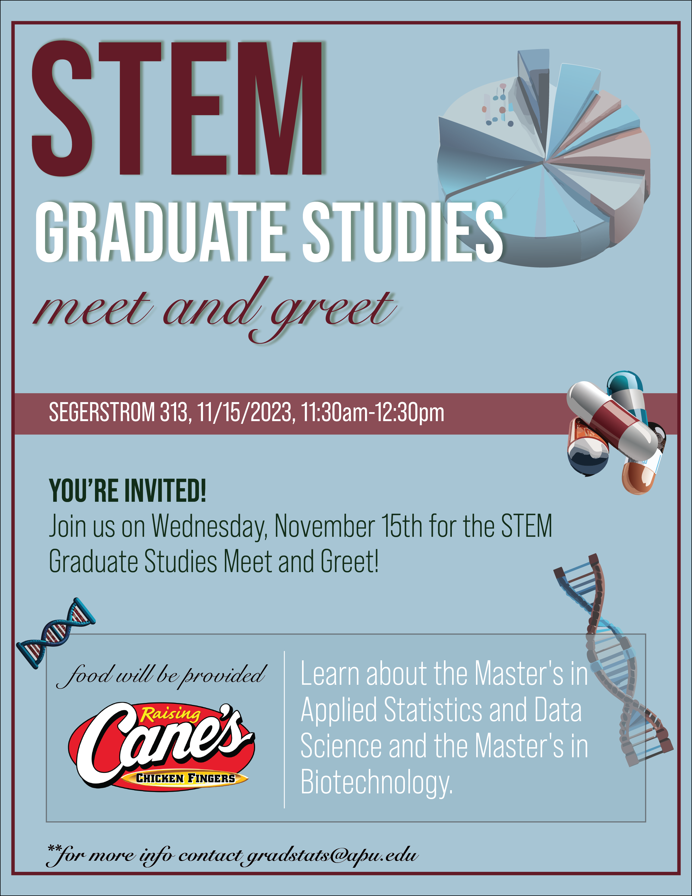

```{r setup, include=FALSE}
knitr::opts_chunk$set(echo = TRUE)
```

### Statistician(s) of the Week

[Jo Hardin](https://hardin47.netlify.app/about/)

[Mine Cetinkaya-Rundel](https://mine-cr.com)

<!-- ### Thursday announcements -->

<!-- -   Due now: Rough draft .zip uploaded to Google Drive -->

<!-- -   WEEK 13 (AFTER THANKSGIVING) -->

<!--     -   For Tuesday class-time: Read two assigned rough drafts -->

<!--         -   Group 1 (Avery & Rachel) - read Groups 2 & 3 -->

<!--         -   Group 2 (Evan & Jason) - read Groups 3 & 4 -->

<!--         -   Group 3 (Dat & Leon) - read Groups 1 & 4 -->

<!--         -   Group 4 (Angie & Caylee) - read Groups 2 & 5 -->

<!--         -   Group 5 (Enzo & Lauren) - read Groups 1 & 2 -->

<!--     -   For Thursday class-time: Prep Quiz 13 (10 min lecture, then 3 Prep Activities with Shiny Apps) -->

<!--     -   Any last stats experience points (5 total for semester) due Thursday -->

<!-- -   Today: -->

<!--     -   wrap up Lab corrections together -->

<!--     -   Mini-lecture on communicating results part 2 -->

<!--     -   I like / I wish data viz activity -->

<!--     -   Start brainstorming / drafting poster design -->

<!-- +--------------+--------------------------------------+---------------------------------------------+ -->
<!-- |              | Tue in-class                         | Thur in-class                               | -->
<!-- +==============+======================================+=============================================+ -->
<!-- | Week 12      | Communicating Results Part 1 (no AE) | Communicating Results Part 2 (no Lab)       | -->
<!-- +--------------+--------------------------------------+---------------------------------------------+ -->
<!-- | Week 13      | Peer Review                          | Shiny Apps (Lab 09)                         | -->
<!-- +--------------+--------------------------------------+---------------------------------------------+ -->
<!-- | Week 14      | Poster work session                  | Poster peer review                          | -->
<!-- +--------------+--------------------------------------+---------------------------------------------+ -->
<!-- | Week 15      |                                      | Poster presentations - invite your friends! | -->
<!-- +--------------+--------------------------------------+---------------------------------------------+ -->

### Announcements

<!-- ###  -->

<!--  -->

<!-- -   2 extra credit points on your final project (b/c relevant to communicating data!) -->

<!-- -   Attending grad info session could be 1 stats experience point -->

<!-- -   Register for Putnam Exam! Saturday, December 1. Talk to Dr. Mathews. -->

<!-- -   THIS WEEK -->

<!--     -   Rough drafts due Thursday by classtime! Upload .zip to Google Drive -->

<!--     -   BEFORE CLASS THURSDAY: Watch 2 YouTube videos on Perusall (see note about starting partway through video 1) -->

<!-- +--------------+--------------------------------------+---------------------------------------------+ -->
<!-- |              | Tue in-class                         | Thur in-class                               | -->
<!-- +==============+======================================+=============================================+ -->
<!-- | Week 12      | Communicating Results Part 1 (no AE) | Communicating Results Part 2 (no Lab)       | -->
<!-- +--------------+--------------------------------------+---------------------------------------------+ -->
<!-- | Week 13      | Peer Review                          | Shiny Apps (Lab 09)                         | -->
<!-- +--------------+--------------------------------------+---------------------------------------------+ -->
<!-- | Week 14      | Poster work session                  | Poster peer review                          | -->
<!-- +--------------+--------------------------------------+---------------------------------------------+ -->
<!-- | Week 15      |                                      | Poster presentations - invite your friends! | -->
<!-- +--------------+--------------------------------------+---------------------------------------------+ -->

### Questions?

### Rough Draft Peer Review

Why peer review?

-   Giving good feedback is a skill (that we don't often practice)

-   Receiving and incorporating feedback effectively also takes practice

-   Our work is better when we have multiple perspectives speak into it

-   Makes us better at self-assessing our own work

-   It's part of the scientific process

<!-- Logistics: -->

<!-- -   (15 mins) In your project groups, discuss assigned paper and fill out the "SHORT Rough Draft Peer Feedback - Group X" form in the shared [Google Drive folder](https://drive.google.com/drive/folders/190TgJca5qleOGoQQMJ6IbLj_RbSRKtOE?usp=share_link) (located in the folder of the group you're reviewing) -->

<!-- -   (15 mins) Pair up with the group and exchange feedback (\~7 mins per group) -->

<!-- -   Remainder of class will be spent on working on your FORMAL review (this is graded and counts towards your final project grade!) -->

<!-- +---------------+--------------------+ -->
<!-- |               | Group pairings     | -->
<!-- +===============+====================+ -->
<!-- | Session 1     | Group 1 & Group 3  | -->
<!-- |               |                    | -->
<!-- |               | Group 2 & Group 4  | -->
<!-- |               |                    | -->
<!-- |               | Group 5 & Dr. Fitz | -->
<!-- +---------------+--------------------+ -->

<!-- For the group you did NOT already exchange feedback with, you will write up a FORMAL peer review -->

<!-- -   Group 1 formally reviews Group 2 -->
<!-- -   Group 2 formally reviews Group 3 -->
<!-- -   Group 3 formally reviews Group 4 -->
<!-- -   Group 4 formally reviews Group 5 -->
<!-- -   Group 5 formally reviews Group 1 -->

<!-- Your formal review will include: -->

<!-- -   FORMAL evaluation rubric filled out (Written report section ONLY) (in the folder of the group you're reviewing) -->
<!-- -   A brief write-up (\~1 page) highlighting the following: -->
<!--     -   A summary of the research questions, data context, and findings, as you understand them -->
<!--     -   Brief comments on strengths of the paper -->
<!--     -   Constructive criticism, raising questions / points of confusion, and outlining what needs to be changed/improved in order for the report to be exemplary -->

<!-- The constructive criticism should make up the bulk of the 1-page review. Remember: the goal is to help them IMPROVE the work. You should NOT simply tell them it's wonderful, and you should NOT simply criticize without offering concrete suggestions for HOW to improve. -->
