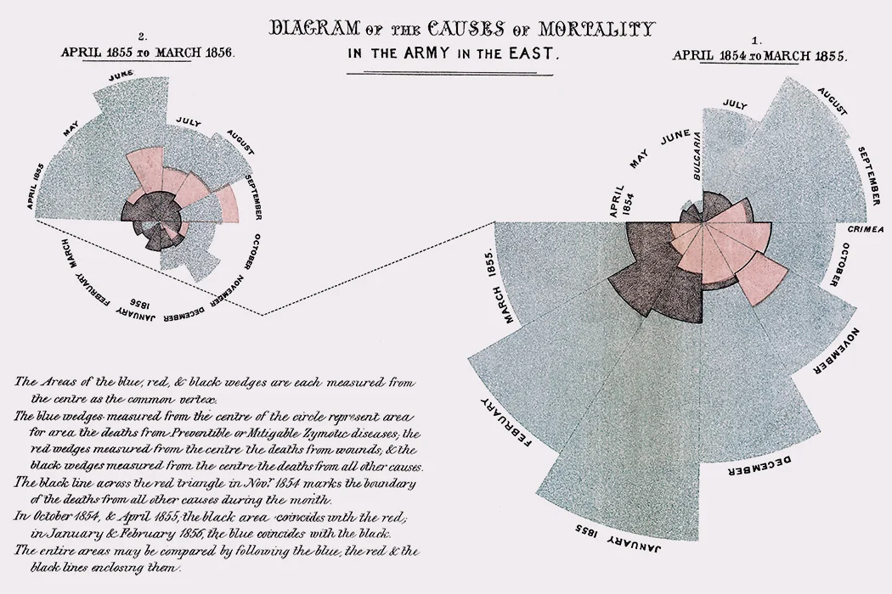

```{r setup, include=FALSE}
knitr::opts_chunk$set(echo = TRUE)
```

```{r, message = FALSE, warning = FALSE, echo = FALSE}
library(tidyverse)
library(ggthemes)
#library(bbplot)
library(cowplot)
```

### Thursday Announcements

 - Save the Date: CEMPS BBQ Next Friday (free food!), 5 - 7pm
 - Save the Date: APU STEM Research Symposium Saturday, Sept 21
    + counts as 2 Stats Experience points!


  - For next week: lecture videos a little shorter (3 videos, 50 mins), but annotation content longer 
    + Content warning: racism in science 

### Statistician(s) of the Week

[W.E.B. DuBois](https://hardin47.github.io/CURV/scholars/dubois.html)

Check out his [book](https://www.amazon.com/W-Boiss-Data-Portraits-Visualizing/dp/1616897066)! I have a copy in my office.


[Florence Nightingale](https://hardin47.github.io/CURV/scholars/nightingale.html)



### Announcements

+ Annotations due Thursday
+ Lab 01 due Thursday

### A few notes / tips

<!-- -   Setting changes (under Settings icon): -->
<!--     -   Select "Preview in Viewer Pane" -->
<!--     -   Select "Chunk Output in Console" -->
-   Add `color = "white"` to your `geom_histogram()` layers

```{r, message = FALSE, warning = FALSE, echo = FALSE}
p1 <- ggplot(midwest, aes(x = percbelowpoverty)) +
  geom_histogram()

p2 <- ggplot(midwest, aes(x = percbelowpoverty)) +
  geom_histogram(color = "white") +
  labs(title = "geom_histogram(color = \"white\")")

plot_grid(p1, p2, nrow = 1)
```

-   Check out different theme options in `ggplot`. Default is `theme_gray()`. I typically use `theme_minimal()` to de-clutter some of the background.

```{r, echo = FALSE}
p1 <- ggplot(midwest, aes(y = percbelowpoverty, x = area,
                    color = state)) +
  geom_point() +
  labs(title = "theme_gray()") +
  scale_color_viridis_d()

p2 <- ggplot(midwest, aes(y = percbelowpoverty, x = area,
                    color = state)) +
  geom_point() +
  theme_minimal() +
  labs(title = "theme_minimal()") +
  scale_color_viridis_d()

plot_grid(p1, p2, nrow = 1)
```

-   The [`ggthemes` package](https://github.com/jrnold/ggthemes) has many additional themes to choose from

```{r, echo = FALSE}
p1 <- ggplot(midwest, aes(y = percbelowpoverty, x = area,
                    color = state)) +
  geom_point() +
  theme_fivethirtyeight() +
  labs(title = "theme_fivethirtyeight()") +
  scale_color_viridis_d()

p2 <- ggplot(midwest, aes(y = percbelowpoverty, x = area,
                    color = state)) +
  geom_point() +
  theme_wsj() +
  labs(title = "theme_wsj()") +
  scale_color_viridis_d()

p3 <- ggplot(midwest, aes(y = percbelowpoverty, x = area,
                    color = state)) +
  geom_point() +
  theme_economist() +
  labs(title = "theme_economist()") +
  scale_color_viridis_d()

p4 <- ggplot(midwest, aes(y = percbelowpoverty, x = area,
                    color = state)) +
  geom_point() +
  theme_solarized_2(light = FALSE) +
  labs(title = "theme_solarized_2(light = FALSE)") +
  scale_color_viridis_d()

plot_grid(p1, p2, p3, p4, nrow = 2)
```

-   This blogpost ["Themes to spice up visualizations with ggplot2"](https://towardsdatascience.com/themes-to-spice-up-visualizations-with-ggplot2-3e275038dafa) suggests several more packages with many additional themes to play with

-   Make sure to use colorblind friendly pallets! `scale_color_viridis_d` (and its variations) is my default, `scale_color_colorblind()` is another common option, from the `ggthemes` package

```{r, echo = FALSE}
p1 <- ggplot(midwest, aes(y = percbelowpoverty, x = area,
                    color = state)) +
  geom_point() +
  theme_minimal() +
  labs(title = "scale_color_viridis_d()") +
  scale_color_viridis_d()

p2 <- ggplot(midwest, aes(y = percbelowpoverty, x = area,
                    color = state)) +
  geom_point() +
  theme_minimal() +
  labs(title = "scale_color_colorblind()") +
  scale_color_colorblind()

plot_grid(p1, p2, nrow = 1)
```

-   Save the fiddling with beautification until the end - this can be an endless time suck if you're not careful :)

-   Keep in mind that you're not just practicing your technical coding skills, but you're also developing your investigative skills as a data scientist - **be curious about the data** and **dig further** into it when your visualizations reveal certain patterns or unusual observations.

<!-- ### Group dynamics / reminder of norms -->

<!-- -   Everyone has expertise -->

<!-- -   Be present -->

<!-- -   Participate to the best of your ability -->

<!-- -   Share talk time -->

<!-- -   Critique ideas, not people -->

<!-- -   Engage new perspectives with curiosity, not judgement -->

<!-- -   Exhibit intellectual humility -->

<!-- -   Embrace discomfort & non-closure -->

<!-- -   Normalize time to think -->

<!-- -   New: be patient with yourself and others as you learn -->

<!-- -   New: value question-asking! -->

<!-- -   Others?? -->

<!-- ### Questions? -->

<!-- *What's the difference between typing code in the console vs. the .qmd document?* -->

<!-- -   The console is just for quick calculations / commands - but nothing in the console gets saved! -->

<!-- -   When you're learning, type everything in the .qmd to be safe, then delete what you don't need / what doesn't work -->

<!-- -   When you click "Render", R runs the document from top to bottom (skipping over any code chunks with `eval: false`). You will get an error if you have a code chunk that depends on a package you've only loaded in your console, or an object you've only defined there. -->

<!-- -   Exception: `View(name_of_dataset)` should ONLY be typed in the console. -->

<!-- *What are the possibilities for theme/layout for R?* -->

<!-- -   [html themes](https://www.datadreaming.org/post/r-markdown-theme-gallery/) we saw in Lab 01 -->
<!-- -   Note, you can use Quarto to create -->
<!--     -   pdfs, word documents, presentation slides -->
<!--     -   books using the `bookdown` package (see [here](https://openintro-ims.netlify.app) and [here](https://nustat.github.io/intro-stat-ds/)) -->
<!--     -   websites using the `blogdown` package (see [here](https://www.silviacanelon.com) and [here](https://katie-fitzgerald.netlify.app)), and -->
<!--     -   interactive web apps using the `shiny` package (see [here](https://gallery.shinyapps.io/freedom-press-index/?_ga=2.81315735.1827555729.1662265788-1653842836.1662265788#home) and [here](https://kgfitz.shinyapps.io/confidence_intervals/?_ga=2.165073215.1872464027.1644259610-1518862278.1644259610))! -->

### Live coding demo

- Download week-02-live-code.qmd to follow along

### Application Exercise

-   The remainder of class will be spent on AE-02.
-   You can access it from GitHub.
-   It is due at the end of class today.
-   To turn it in, you should upload your .html file to Blackboard.
