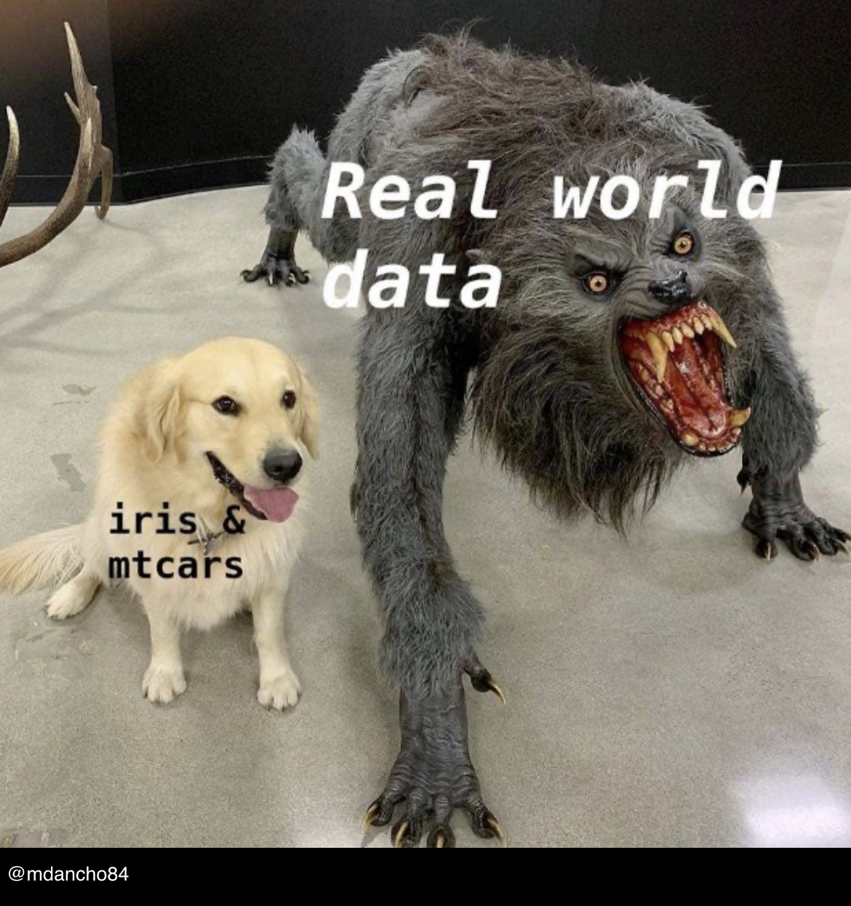

```{r setup, include=FALSE}
knitr::opts_chunk$set(echo = TRUE)
```

### Statistician(s) of the Week

[Sherri Rose](http://drsherrirose.org/biocv)

[Liz Stuart](https://publichealth.jhu.edu/faculty/1792/elizabeth-a-stuart)

### Tuesday Announcements

[Project Proposal](https://nova-stat-4380.netlify.app/project/#project-proposal) due Saturday, 11:59pm

Two competitions to put on your radar:

1. [DataFest Philly](https://sites.google.com/view/datafestphilly/home) 
    
    - April 10 - 12 here at Villanova!
    - Register by March 28
    - Compete in teams of 2 - 5
2. Next year's [Falvey Data Visualization Competition](https://library.villanova.edu/research/data-services/love-data-week/Falvey-data-visualization-competition) - your projects for this class would make great submissions!  

Today: Lab 06 - data cleaning




### Questions?


