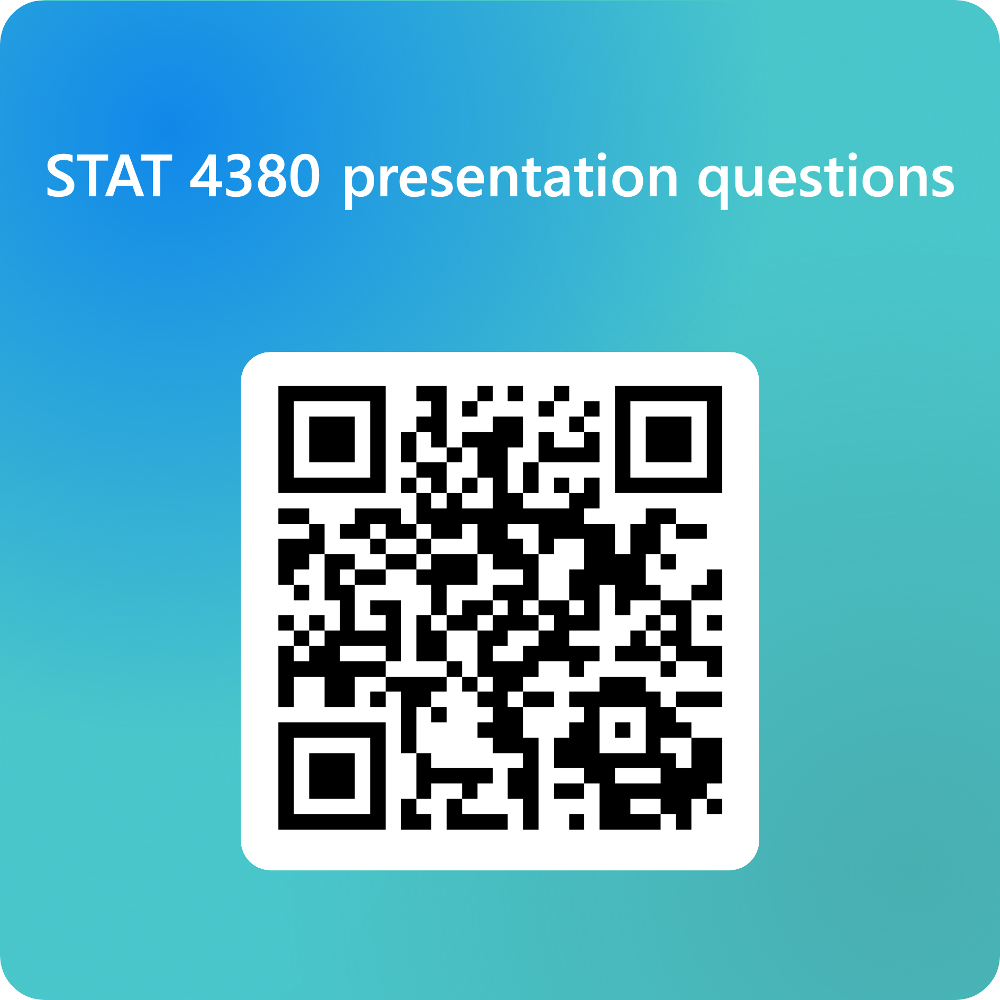

```{r setup, include=FALSE}
knitr::opts_chunk$set(echo = TRUE)
```

# Announcements

-   End-of-course reflection (\~1 page) due Thursday, 11:59pm
-   Final deliverables due Monday, May 4, 11:59pm (make sure you incorporate peer review feedback!)
-   Fill out [End-of-semester survey](https://forms.office.com/r/iMz5LWdaes) by Thursday (so far 40% have filled it out, need \>80% for extra credit)
-   Will take first 10 mins of class on Thursday for CATS

# Recs for learning more

-   Recidivism

    -   Many Lives of Mama Love (book - memoir)

    -   13th (documentary, on Netflix)

    -   The New Jim Crowe (book)

-   Nuclear Energy - Chernobyl (HBO series)

-   Climate Disasters & Economic Implications

    -   Katrina: Come Hell or High Water (Netflix documentary)

-   Gender

    -   Invisible Women: Data Bias in a World Built for Men (book)

    -   Of Boys & Men: Why the modern male is struggling, why it matters, and what to do about it (book)

    -   Explained: Why Women are Paid Less (Netflix short doc)

-   Screen time

    -   The Anxious Generation (book)

    -   The Social Dilemma (doc on Netflix)

-   Economics of Higher Education

    -   Weapons of Math Destruction (book)

    -   Malcolm Gladwell podcasts: Food Fight, I Hate The Ivy League

    -   Varsity Blues (Netflix doc)

# Q&A logistics

-   Each person should submit one question per presentation, using [this link](https://forms.office.com/r/t1YnzJnS8Q) or QR Code below
-   Your question should be SUBSTANTIVE (e.g., about the context, data, analysis, limitations, implications, etc).
-   Asking questions such as "what was your favorite part?" are not sufficient


