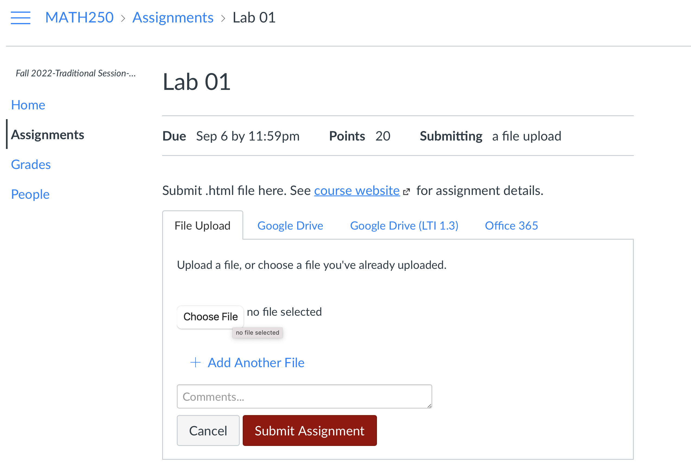

```{marginfigure}
R is the name of the programming language itself and RStudio is a convenient interface.
```

# Goals

The main goal of this lab is to introduce you to R and RStudio, which we will be using throughout the course both to learn the statistical concepts discussed in the course and to analyze real data and come to informed conclusions.

You will...

+ Access help documentation with `?`
+ Create scatterplots
+ Calculate correlation coefficients
+ Tweak the YAML 

As the labs progress, you are encouraged to explore beyond what the labs dictate; a willingness to experiment will make you a much better programmer.
Before we get to that stage, however, you need to build some basic fluency in R.
Today we begin with the fundamental building blocks of R and RStudio: the interface, reading in data, and basic commands.

For this lab, you will collaborate in your (randomly assigned) groups (see Canvas), but you will each submit your own lab.
You may share code with your group via Canvas Group Messages (general FYI - instructors can see these messages!).

# Getting Started - RStudio

You should have already downloaded R & RStudio and created an R Project called "MATH_250".
If you haven't, touch base with the professor to get set up.
To get started on this lab, do the following:

-   Open our class [GitHub repo](https://github.com/kgfitzgerald/APU_MATH_250_templates)
-   Navigate to LABS \> lab-01.qmd
-   Click to "Download raw file"
-   Place the downloaded .qmd document in your MATH_250 folder on your computer
-   From inside your MATH_250 RStudio Project, open and render the Quarto document

The document you are currently reading has all the instructions for Lab 01, but you will complete the lab by adding code and text responses to the `lab-01.qmd` document in RStudio.

## Warm up

Before we introduce the data, let's warm up with some simple exercises.

```{marginfigure}
The top portion of your Quarto file (between the three dashed lines) is called YAML. It stands for "YAML Ain't Markup Language". It is a human friendly data serialization standard for all programming languages. All you need to know is that this area is called the YAML (we will refer to it as such) and that it contains meta information about your document.
```

### YAML

In the Quarto (qmd) file in your project, change the author name to your name, and render the document.

## Packages

In this lab we will work with two packages: **datasauRus** which contains the dataset we'll be using and **tidyverse** which is a collection of packages for doing data analysis in a "tidy" way.
These packages should already be installed if you ran the code in the `install_packages.R` file previously.
You can load the packages by running the following in the Console.

```{r message=FALSE}
library(tidyverse) 
library(datasauRus)
```

Note that the packages are also loaded with the same commands in your Quarto document.

## Data

```{marginfigure}
If it's confusing that the data frame is called `datasaurus_dozen` when it contains 13 datasets, you're not alone! Have you heard of a [baker's dozen](https://en.wikipedia.org/wiki/Dozen#Baker's_dozen)?
```

The data frame we will be working with today is called `datasaurus_dozen` and it's in the `datasauRus` package.
Actually, this single data frame contains 13 datasets, designed to show us why data visualisation is important and how summary statistics alone can be misleading.
The different datasets are marked by the `dataset` variable.

To find out more about the dataset, type the following in your Console:

`?datasaurus_dozen`

A question mark before the name of an object will always bring up its help file.
This command must be run in the Console.

# Exercises

1.  Based on the help file, how many rows and how many columns does the `datasaurus_dozen` file have? What are the variables included in the data frame? Add your responses to your lab report.

Let's take a look at what these datasets are.
To do so we can make a *frequency table* of the dataset variable:

```{r}
datasaurus_dozen |>
  count(dataset)
```

```{marginfigure}
Matejka, Justin, and George Fitzmaurice. "Same stats, different graphs: Generating datasets with varied appearance and identical statistics through simulated annealing." Proceedings of the 2017 CHI Conference on Human Factors in Computing Systems. ACM, 2017.
```

The original Datasaurus (`dino`) was created by Alberto Cairo in [this great blog post](http://www.thefunctionalart.com/2016/08/download-datasaurus-never-trust-summary.html).
The other Dozen were generated using simulated annealing and the process is described in the paper *Same Stats, Different Graphs: Generating Datasets with Varied Appearance and Identical Statistics* through Simulated Annealing by Justin Matejka and George Fitzmaurice.
In the paper, the authors simulate a variety of datasets that have the same summary statistics as the Datasaurus but have very different distributions.

2.  Plot `y` vs. `x` for the `dino` dataset. Then, calculate the correlation coefficient between `x` and `y` for this dataset. *Below is the code you will need to complete this exercise. Basically, the answer is already given, but you need to include relevant bits in your .qmd document and successfully render it and view the results.*

Start with the `datasaurus_dozen` and pipe it into the `filter` function to filter for observations where `dataset == "dino"`.
Store the resulting filtered data frame as a new data frame called `dino_data`.

```{r}
dino_data <- datasaurus_dozen |>
  filter(dataset == "dino")
```

There is a lot going on here, so let's slow down and unpack it a bit.

First, the pipe operator: `|>`, takes what comes before it and sends it as the first argument to what comes after it.
So here, we're saying `filter` the `datasaurus_dozen` data frame for observations where `dataset == "dino"`.

Second, the assignment operator: `<-`, assigns the name `dino_data` to the filtered data frame.

Next, we need to visualize these data.
We will use the `ggplot` function for this.
Its first argument is the data you're visualizing.
Next we define the `aes`thetic mappings.
In other words, the columns of the data that get mapped to certain aesthetic features of the plot, e.g. the `x` axis will represent the variable called `x` and the `y` axis will represent the variable called `y`.
Then, we add another layer to this plot where we define which `geom`etric shapes we want to use to represent each observation in the data.
In this case we want these to be points, hence `geom_point`.

```{r fig.fullwidth=TRUE}
ggplot(data = dino_data, mapping = aes(x = x, y = y)) +
  geom_point()
```

If this seems like a lot, it is.
And you will learn about the philosophy of building data visualizations in layers in detail next week.
For now, follow along with the code that is provided.

For the second part of these exercises, we need to calculate a summary statistic: the correlation coefficient.
Correlation coefficient, often referred to as $r$ in statistics, measures the linear association between two variables.
You will see that some of the pairs of variables we plot do not have a linear relationship between them.
This is exactly why we want to visualize first: visualize to assess the form of the relationship, and calculate $r$ only if relevant.
In this case, calculating a correlation coefficient really doesn't make sense since the relationship between `x` and `y` is definitely not linear -- it's dinosaurial!

But, for illustrative purposes, let's calculate the correlation coefficient between `x` and `y`.

```{marginfigure}
Start with `dino_data` and calculate a summary statistic that we will call `r` as the `cor`relation between `x` and `y`.
```

```{r}
dino_data |>
  summarize(r = cor(x, y))
```

`r emo::ji("pause_button")` `r emo::ji("right_arrow")` ✅ *This is a good place to pause and Render to make sure there are no errors in your .qmd*

3.  Plot `y` vs. `x` for the `star` dataset. You can (and should) reuse code we introduced above, just replace the dataset name with the desired dataset. Then, calculate the correlation coefficient between `x` and `y` for this dataset. How does this value compare to the `r` of `dino`?

`r emo::ji("pause_button")` `r emo::ji("right_arrow")` ✅ *This is a good place to pause and Render to make sure there are no errors in your .qmd*

4.  Plot `y` vs. `x` for the `circle` dataset. You can (and should) reuse code we introduced above, just replace the dataset name with the desired dataset. Then, calculate the correlation coefficient between `x` and `y` for this dataset. How does this value compare to the `r` of `dino`?

`r emo::ji("pause_button")` `r emo::ji("right_arrow")` ✅ *This is a good place to pause and Render to make sure there are no errors in your .qmd*

```{marginfigure}
Facet by the dataset variable, placing the plots in a 3 column grid, and don't add a legend.
```

5.  Finally, let's plot all datasets at once and calculate the correlation coefficient for each (code below). Comment on your findings - articulate why this is a cautionary tale about the correlation coefficient! (Google "correlation coefficient" if you're unsure what it measures). 

In order to plot all 12 datasets we will make use of faceting.

```{r all-viz, eval=FALSE, fig.fullwidth=TRUE}
ggplot(datasaurus_dozen, aes(x = x, y = y, color = dataset))+
  geom_point()+
  facet_wrap(~ dataset, ncol = 3) +
  theme(legend.position = "none")
```

And we can use the `group_by` function to generate all the summary correlation coefficients.

```{r all-r, eval=FALSE}
datasaurus_dozen |>
  group_by(dataset) |>
  summarize(r = cor(x, y))
```

You're done with the data analysis exercises, but I'd like you to do two more things:


-   **Resize your figures:**

In the YAML under the `html:` settings, add `fig-width: 3` and `fig-height: 3` This will make each plot 3 inches by 3 inches.

```{r fig-resize-global, echo = FALSE, fig.width=3}
knitr::include_graphics("img/fig-resize-global.png")
```

You can also use different figure sizes for different figures.
To do so, add `#| fig-width: ` and `#| fig-height: ` as two new lines to the top of the code chunk for the figure you want to change. For example, change the figure in Exercise 5 to be 15 x 9.


```{r fig-resize-local, echo = FALSE, fig.width=3}
knitr::include_graphics("img/fig-resize-local.png")
```


-   **Change the look of your report:**

In the YAML, this lab is currently set to have `theme: "cosmo"`. See a list of all available themes below and on the [Quarto website](https://quarto.org/docs/output-formats/html-themes.html).
Play around with these until you're happy with the look.

```{r theme-highlight, fig.margin = FALSE, echo = FALSE, fig.width=3}
knitr::include_graphics("img/theme.png")
```

```{r view-html, fig.margin = TRUE, echo = FALSE, fig.width=3}
knitr::include_graphics("img/view-html.png")
```

`r emo::ji("right_arrow")` ✅ ⬆️ *Yay, you're done! Render one last time, and verify that everything is displayed correctly in your lab-01.html file. To view the .html, click on the file name in the Files quadrant, and select "View in Web Browser". If everything looks good, you're ready to submit!*

# Submit

To submit, you need to upload your lab-01.html file to the Lab 01 assignment on Canvas.


```{r canvas, fig.margin = TRUE, echo = FALSE, fig.width=3}

```

To submit on Canvas, follow these steps:

-   Navigate to Lab 01 under assignments
-   Click "Start Assignment"
-   Click "Upload File"
-   Click "Choose File"
-   In the pop-up window, navigate to your MATH_250 folder and select "lab-01.html"
-   Click "Submit Assignment"

# Grading (50 pts)

<br>

| Component             | Points |
|:----------------------|:-------|
| Ex 1                  | 8      |
| Ex 2                  | 8      |
| Ex 3                  | 8      |
| Ex 4                  | 8      |
| Ex 5                  | 8      |
| Reflection prompts    | 5     |
| Workflow & formatting | 5     |


**Grading notes**:

-   The "Workflow & formatting" grade is to assess the reproducible workflow. This includes having readable code (e.g. adequate use of spacing and line breaks), labeled code chunks, informative headers and sub-headers, and an overall organized and uncluttered report (e.g. suppress messages & warnings, no extraneous output).
