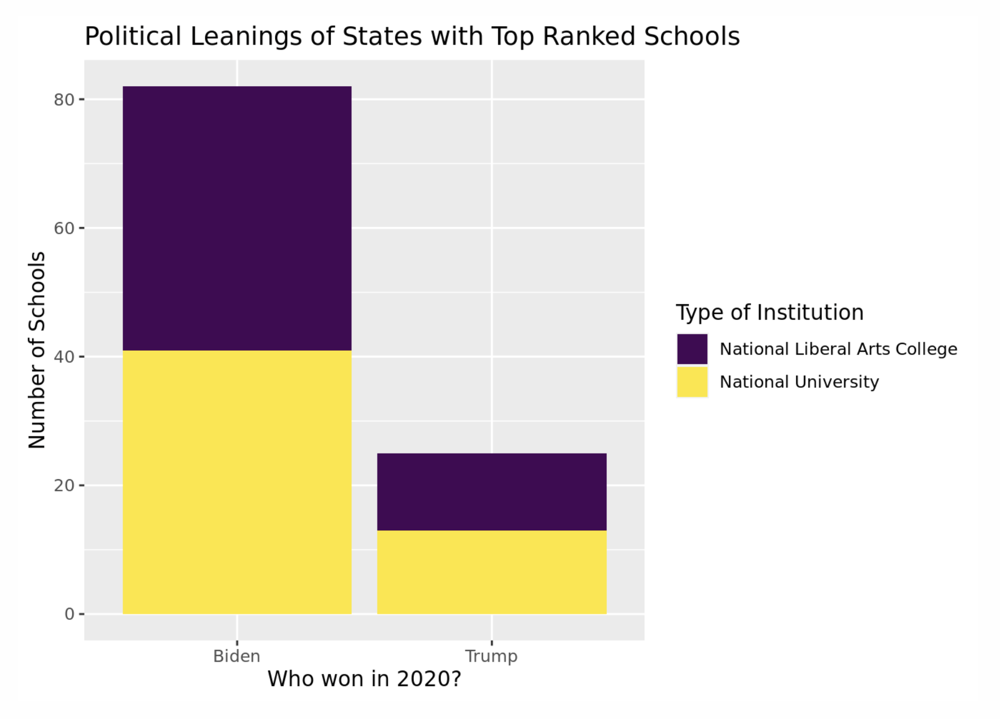

# Goals

In this lab, you will...

- Develop proficiency with data-wrangling functions
- Answer real research questions using related data sets

# Getting started

+ You will be working in your randomly assigned Lab 03 - 04 Groups. See Blackboard.
+ Open our class [GitHub repo](https://github.com/kgfitzgerald/NOVA_STAT_4380/tree/main/assignment_templates) and download the .qmd file for this lab. Refer back to [Lab 01](https://kgfitzgerald.github.io/NOVA_STAT_4380/labs/lab-01-hello-r.html) for detailed instructions on how to get started on a lab. 

All plots should follow the best visualization practices discussed in lecture, including an informative title, labeled axes, and careful consideration of aesthetic choices.

All code should follow the [tidyverse style guidelines](https://style.tidyverse.org/pipes.html).

# Packages

We will use the **tidyverse** package for this assignment. If you wish to use the viridis color palettes, you will need the **viridis** package as well. 

```{r load-package, message = FALSE, warning = FALSE}
library(tidyverse)
library(viridis)
library(kableExtra)
library(scales)
```

# Data 

The U.S. News rankings are an [influential, but controversial](https://www.vox.com/2014/9/5/6106807/college-rankings-us-news-boston-clemson-problems) metric that influences the college application process.

A brief description of the data sets for this lab and how they are related to each other is provided below.

The `natunivs` data set contains all schools in the National Universities category ranked 50 or above in the current (2022) rankings. Data on school rankings comes from [Andy Reiter](https://andyreiter.com/datasets/), with several blank values filled in by the professor. Observations are uniquely identified by school.

The variables in this data set are:

+ `school`: The name of the college or university.
+ `state`: The state in which the college or university is located.
+ `rank_2022`: The school’s rank in the 2022 issue.
+ `rank_2021`: The school’s rank in the 2021 issue.
+ `natuniv_slac`: A variable identifying the type of school.

The `slacs` data set contains contains all schools in the National Liberal Arts Colleges category ranked 50 or above in the current (2022) rankings. Data on school rankings comes from Andy Reiter. Observations are uniquely identified by school.

The variables in this data set are:

+ `school`: The name of the college or university.
+ `state`: The state in which the college or university is located.
+ `rank_2022`: The school’s rank in the 2022 issue.
+ `rank_2021`: The school’s rank in the 2021 issue.
+ `natuniv_slac`: A variable identifying the type of school.

The `presvote_pop` data set contains four variables related to the characteristics of a state:

+ `abbrev`: The state’s abbreviation.
+ `trump_votes`: The number of votes received by Donald Trump in 2020.
+ `biden_votes`: The number of votes received by Joe Biden in 2020.
+ `2020_pop`: The state’s population in the 2020 census.

The Trump and Biden votes variables come from the CQ Voting and Elections Collection, which was accessed through the Duke Library. The 2020 population data comes from the [US Census](https://www.census.gov/library/visualizations/interactive/2020-population-and-housing-state-data.html).

# Exercises


1. Let’s start by creating an analysis data set that includes information from all three data sets.

- First, join the `slacs` data set to the `natunivs` data set. The goal is to combine these data sets in such as a way so that the new data set has the total number of rows and unique columns as each of the individual data sets. Call this new data set `full_data`. 
- Next, use a join to add the columns from the `presvote_pop` data set to `full_data`.

**The final full_data data frame should have 107 observations and 8 variables.**

We will use `full_data` for the remainder of the assignment. (Please note that there are more than 100 observations total due to ties at 50.)
  
2. *Which states have the most top-ranked schools?* Produce a nicely formatted table that reports the top 5 states with the most schools in the `full_data`.

3. Which states do not have a school in the `full_data` data set? Use the `presvote_pop` data set and an appropriate join to help answer this question. Return a data set with two variables, state abbreviations and state population, in order from greatest population to least. Show all code and output, and print the state abbrevations and populations. What is the state with the largest population that does not have a school in the `full_data` data set?

4. Recreate the below plot. Use a `dplyr` command to create the variable noting which presidential candidate won the state in 2020. After recreating the plot, discuss what patterns you observe.

```{r photo, echo = FALSE,  eval = TRUE}

```

5. *Is there a relationship between the population of a state and the number of schools it has in the `full_data` data set?* To answer this question, first use the code from exercise 2 to create a data set called counts with the counts of the number of schools by state for the 31 states with at least one school in the `full_data` data set.

```{marginfigure}
Tip: Convert your x-axis scale to millions using the following layer: `scale_x_continuous(labels = label_number(suffix = " M", scale = 1e-6))`. This requires the `scales` package.
```

- Then, use a join to add `counts` to the `full_data` data set and make a scatter plot with a state’s 2020 population as the x-axis variable and the number of schools as the y-axis variable. Add a line of best fit using the `method = "lm"` option. Include an informative title and axis labels.
- Finally, describe what you observe. Is there a positive or negative relationship? Do most points fall near the line?

6. Let’s now focus on California schools in the `full_data` data set. For these schools, create a new variable that indicates the change in ranking in 2022 compared to 2021, where a positive value indicates an increased ranking (e.g., if a school went from 21 to 20, you would want this variable to have a value of 1.) Finally, produce a table that shows the name of the CA schools and the new variable you created. Discuss what you observe.

7. Do the politics and populations of states where national universities are located differ from those where national liberal arts colleges are located?

- Using the `full_data` data set, create a new variable for the percentage of the vote Joe Biden received in a state in 2020. (Note: You can ignore third party vote here since it is not in the data set.)
- Then, calculate the mean Biden vote percentage and mean population of each group of schools and discuss what you find.

## Further exploration

8. What is an additional question you could investigate using this data? State the question, provide a visualization and/or table that investigates it, and comment on what your output shows. 

9. Write a brief paragraph summarizing what you found in this lab, what limitations might exist to the data/analyses, and what additional data you would like to have to explore further questions. 

# Submission

Before submitting your assignment on Blackboard, Render one last time, then open up your .html in a full window and inspect the following:

+ Check your code for neatness - add spaces and line breaks where appropriate to improve readability

+ Check any visualizations for informative and clean labels and titles

+ Check any tables for clean formatting (e.g. with `kbl() |> kable_minmal()`)

+ Check that you've interpreted output as appropriate

+ Make sure extraneous warnings and messages are suppressed (e.g. set `#| warning: false`, `#| message: false`)

+ Check that Exercises are clearly labeled and your text responses are visually distinguished

+ Check for overall neatness & organization of the report (e.g. headers, subheaders, use of bullets, font changes)

To submit, Render one last time and then upload your .html document to the relevant assignment on Blackboard. Refer back to [Lab 01](https://kgfitzgerald.github.io/NOVA_STAT_4380/labs/lab-01-hello-r.html) for detailed instructions on how to submit your assignment. 

# Grading

| Component | Points |
|:----------|:-------|
| Ex 1      | 5      |
| Ex 2      | 5      |
| Ex 3      | 5      |
| Ex 4      | 5      |
| Ex 5      | 5      |
| Ex 6      | 5      |
| Ex 7      | 5      |
| Ex 8      | 5      |
| Ex 9      | 5      |
| Reflection prompts    | 5     |

**Grading notes**:

-   The "Workflow & formatting" grade is to assess the reproducible workflow. This includes having readable code (e.g. adequate use of spacing and line breaks), labeled code chunks, informative headers and sub-headers, and an overall organized and uncluttered report (e.g. suppress messages & warnings, no extraneous output). 
