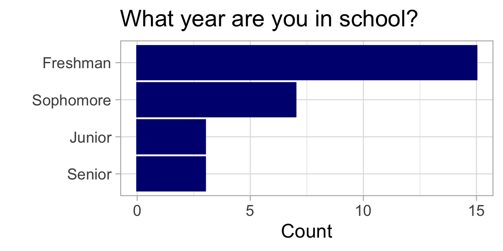
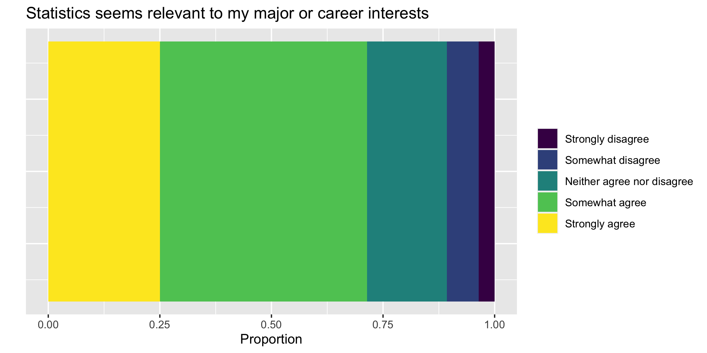
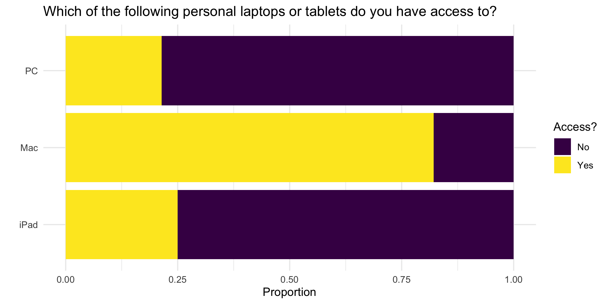
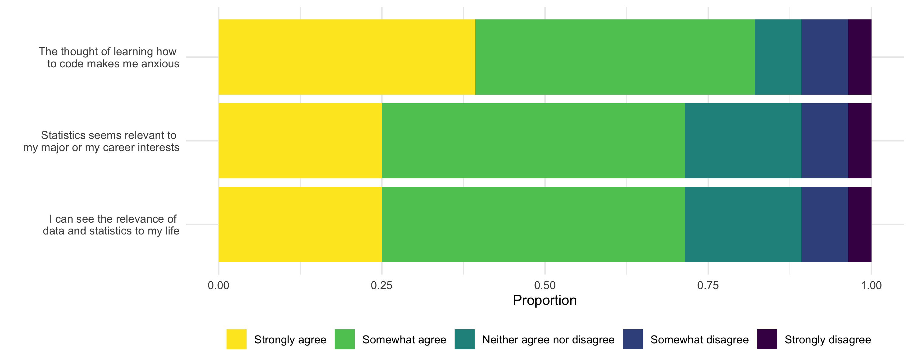

# Goals

In this lab, you will...

- Develop proficiency cleaning survey data
- Wrangle data to create desired visualizations

# Getting started

+ You will be working in your randomly assigned Lab 05 - 06 Groups. See Blackboard.
+ Open our class [GitHub repo](https://github.com/kgfitzgerald/NOVA_STAT_4380/tree/main/assignment_templates) and download the .qmd file for this lab. Refer back to [Lab 01](https://kgfitzgerald.github.io/NOVA_STAT_4380/labs/lab-01-hello-r.html) for detailed instructions on how to get started on a lab. 

All plots should follow the best visualization practices discussed in lecture, including an informative title, labeled axes, and careful consideration ofaesthetic choices.

All code should follow the tidyverse style guidelines.

# Packages

We will use the **tidyverse** package for this assignment. If you wish to use the viridis color palettes, you will need the **viridis** package as well. 

```{r load-package, message = FALSE, warning = FALSE}
library(tidyverse)
library(viridis)
library(lubridate)
```

# Data 

The data come from an intro survey I give my MATH 130 students. Emails and names have been removed for anonymity. We'll read in the data from a url:

```{r, message = FALSE, warning = FALSE}
survey <- read_csv("https://docs.google.com/spreadsheets/d/e/2PACX-1vSt0jO5uaXdC8wDwnFGM8ZZ5oZdUOn2RxRJqOiQidTHLkfNbpf6bP6bH1oBw4tXS0KZHeFdu-9hW9cz/pub?output=csv")
```

The data are currently in the form exactly as provided from a Google Form. You will need to take many necessary cleaning steps to get it in a form that is appropriate for analysis. 

# Exercises

Take a look at the column names.

```{r}
names(survey)
```

1. Create a vector of new names using `c()` and save this vector as `new_names`. You should choose concise and informative names. 

```{r, eval = FALSE}
new_names <- c("variable_1", "variable_2", ...)
```

+ Then use the code `names(survey) <- new_names` to covert the existing column names to the new names. 
+ Inspect your data to ensure that `survey` now has the desired variable names

2. Using the `glimpse()` function will reveal that many of the variables are stored as characters, including the Timestamp variable. Use the function `mdy_hms()` inside a `mutate()` function to convert the timestamp variable to a date. Then create a histogram of this new variable. What does this reveal about the data?

3. Reproduce the following visualization. Note, you will need to re-order the levels of your year variable.

*Hint: `theme_light()` and the color `navyblue` were used*



4. What is the distribution of gender in MATH 130? Create an appropriate visualization. Make decisions about how to clean up the levels and combine as necessary. A `case_when()` inside a mutate may be useful. Comment on the pros and cons of making this a multiple choice vs open-ended question in a survey. 

5. "On a scale from 1 to 10, how anxious are you about taking MATH 130 - Intro to Statistics?" Create an appropriate visualization or summary table to explore this variable.

6. Reproduce the following visualization. Note, you may need to re-order the levels of your variable.

*Hint: Set `y = 1` inside your `aes()` function. And add a `theme` layer where `axis.text.y` and `axis.ticks.y` are set equal to `element_blank()`*



7. What majors are represented in MATH 130? Create a visualization to explore this variable. Make decisions about how to clean up the levels and combine as necessary. A `case_when()` inside a mutate may be useful. Comment on your decisions. 


Select all that apply questions in a survey pose some difficult wrangling tasks. Consider the laptop variable. Suppose we want to explore what percentage of students have each of the three types: Mac laptop, iPad, or PC/Windows laptop.

The following code creates three new variables to indicate if a student has access to each type. Note you will need to adapt this code if you named your variable something other than `laptop.`

```{r, eval = FALSE}
survey <- survey |> 
  mutate(Mac = if_else(grepl("Mac laptop", laptop), "Yes", "No"),
         iPad = if_else(grepl("iPad", laptop), "Yes", "No"),
         PC = if_else(grepl("PC/Windows laptop", laptop), "Yes", "No"))
```

The `grepl()` function searches for a given string (e.g. "Mac laptop") in a given object (`laptop`). It returns the value `TRUE` if the string is present, and `FALSE` if it is not. Combined with the `if_else()` statement, this results in the new variable having the value "Yes" if the string is found and "No" if it is not. 

8. Use a `pivot_longer` to pivot the columns `Mac:PC`. Consider using `names_to = "laptop_type"` and `values_to = "laptop_access"` to name the new pivoted columns. Then, recreate the following visualization. See the animation below to remind you how the `pivot_()` functions work. 



```{r echo = FALSE}
knitr::include_graphics("img/tidyr-longer-wider.gif")
```

# BONUS 

1. Create a new variable called `semester` that uses the time variable to designate whether each student was in MATH 130 in Fall 2021 or Spring 2022. *Hint: the function `year()` applied to a date will extract just the year.*. Use this new variable to investigate whether students in the Fall or Spring semester were more anxious about MATH 130 on average.  

1. Attempt to recreate this visualization as closely as possible. *Hint: you will first need to use a `pivot_longer` and then use a `case_when()` to recode the levels of the new variable to be the full statements seen on the y-axis)*. 



# Submission

Before submitting your assignment on Blackboard, Render one last time, then open up your .html in a full window and inspect the following:

+ Check your code for neatness - add spaces and line breaks where appropriate to improve readability

+ Check any visualizations for informative and clean labels and titles

+ Check any tables for clean formatting (e.g. with `kbl() |> kable_minmal()`)

+ Check that you've interpreted output as appropriate

+ Make sure extraneous warnings and messages are suppressed (e.g. set `#| warning: false`, `#| message: false`)

+ Check that Exercises are clearly labeled and your text responses are visually distinguished

+ Check for overall neatness & organization of the report (e.g. headers, subheaders, use of bullets, font changes)

To submit, Render one last time and then upload your .html document to the relevant assignment on Blackboard. Refer back to [Lab 01](https://kgfitzgerald.github.io/NOVA_STAT_4380/labs/lab-01-hello-r.html) for detailed instructions on how to submit your assignment. 

# Grading

| Component | Points |
|:----------|:-------|
| Ex 1      | 4      |
| Ex 2      | 4    |
| Ex 3      | 4   |
| Ex 4      | 4   |
| Ex 5      | 6      |
| Ex 6      | 6    |
| Ex 7      | 6   |
| Ex 8      | 6   |
| Reflection prompts    | 5     |
| Workflow & formatting | 5     |
| Ex 9 (BONUS) | 1 |
| Ex 10 (BONUS) | 1 |

**Grading notes**:

-   The "Workflow & formatting" grade is to assess the reproducible workflow. This includes having readable code (e.g. adequate use of spacing and line breaks), labeled code chunks, informative headers and sub-headers, and an overall organized and uncluttered report (e.g. suppress messages & warnings, no extraneous output). 
