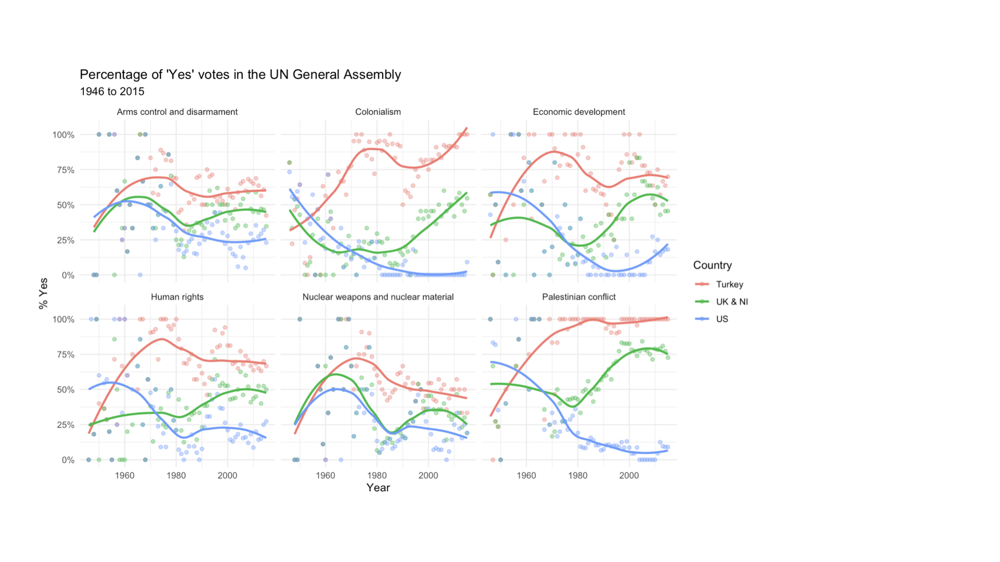
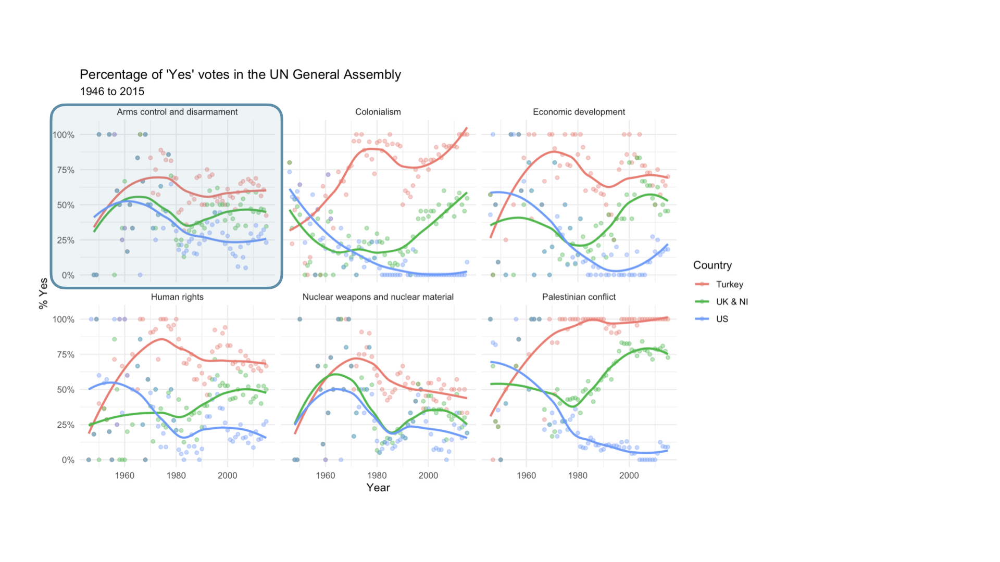
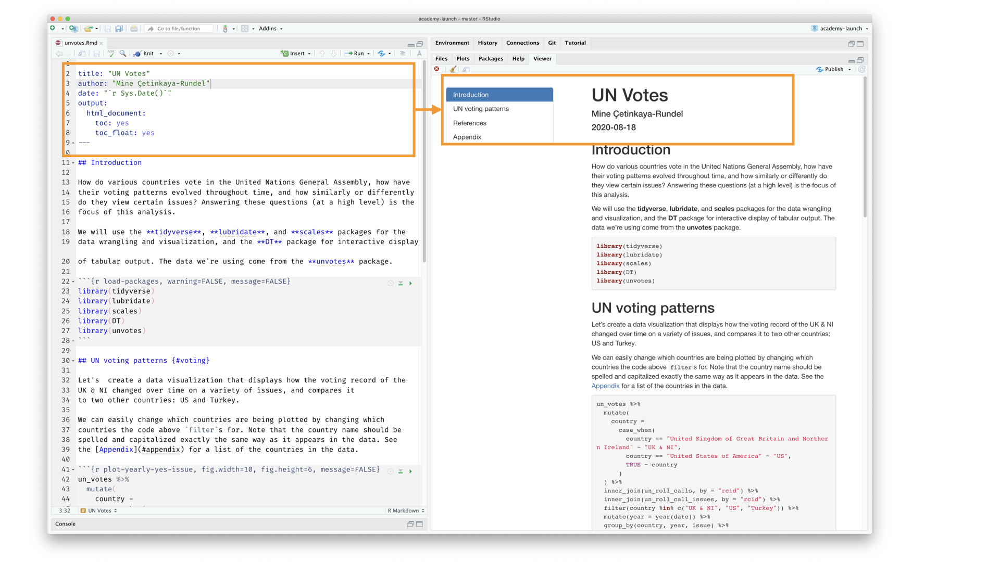

```{r setup}
knitr::opts_chunk$set(
  echo = TRUE,
  fig.width = 8,
  fig.asp = 0.618,
  out.width = "60%",
  fig.align = "center",
  dpi = 300,
  message = FALSE,
  warning = FALSE
)

library(tidyverse)
library(rvest)
```

## STAT 4380: Data Science {.section-divider .center .middle}

## What is data science?

- Data science is an exciting discipline that allows you to turn raw data into understanding, insight, and knowledge.

- Set of tools to help us be better **stewards of information**

- We're going to learn to do this in a `tidy` and reproducible way -- more on that later!

## Course FAQ

**Q - What data science background does this course assume?**  
A - None. Pre-req: one stats class

. . .

**Q - Is this a statistics course?**  
A - While statistics $\neq$ data science, they are very closely related and have tremendous overlap. Hence, this course will help you utilize and further your statistical thinking. However this course is not your typical statistics course - we will emphasize working and thinking with data, not statistical inference or modeling.

. . .

**Q - What computing language / software will we use?**  
A - R

## Some of what you will learn / do

::: {.columns}
::: {.column width="50%"}
- Fundamentals of R & RStudio

- Data visualization and wrangling with `ggplot2` and `dplyr` from the `tidyverse`

- Data science workflow and scientific practice

- Ask good questions of real-world data
:::

::: {.column width="50%"}
- Data communication / storytelling

- Data ethics

- Reproducible reports with `Quarto`
:::
:::

## The Course {.section-divider .center .middle}

## Course Toolkit

**Brightspace**: Central hub of the course. Assignments, Announcements, Gradebook, HELP Forum

**RStudio:** Software -- more on this later!

**GitHub repo:** Assignment templates -- more on this later!

**Perusall:** Community Reading Annotations (data ethics)

## Course structure / assignments

- **Prepare**: lecture videos & short Prep Quiz (due Tuesday class time, 3 attempts)

. . .

- **Tuesday class**: in-class practice, live coding, Q&A

. . .

- **Thursday class**: lab assignments started in-class, due following Thursday

. . .

- **Reading annotations**: engaged with assigned articles/videos/podcasts in Perusall by Tuesdays 11:59pm (first one next week)

. . .

- **In-class Concept Quizzes**: usually on Thursdays (first one next week)

. . .

- **Midterm Data Viz project**: re-create and improve a data visualization from the media (presentations after Fall break)

. . .

- **Course project**: scaffolded throughout the semester, analysis on data of your choosing, related to the broad theme of "data for social good" (presentations during Finals week)

## Where to find help

- In-class!

. . .

- Attend (drop-in) Student Hours
  - Tuesdays 2-2:30 (Mendel 115)
  - Tuesdays 4 – 5:30 (SAC 370)
  - Thursdays 1:15 – 2:15 (SAC 370)

. . .

- Use the HELP Forum (under Discussions in Brightspace) for any questions about course content and/or assignments, since other students may benefit from the response. And it's easier to type code and math, compared to email.

. . .

- Use email for questions regarding personal matters and/or grades.

## Course community & Learning environment

*What do you need [from me, from yourself, from your peers] for this semester to be successful?*

. . .

Traditional vs. flipped learning

- Traditional classroom: first engagement with the material comes via a lecture in class, deeper engagement (e.g. homework) comes outside of class
- Flipped learning: first engagement with the material comes in "individual space", and "group space" is used for deeper engagement with the material, when instructor is still there to guide

. . .

If you have participated in flipped learning before, what was your experience? In what ways did it require a shift in your approach to class/learning?

If you have NOT participated in flipped learning, what is your first impression of the idea? In what ways might it require a shift in your approach to class/learning?

## Class Norms

+ Everyone has expertise
+ Be present
+ Participate to the best of your ability
+ Share talk time
+ Critique ideas, not people
+ Engage new perspectives with curiosity, not judgement
+ Exhibit intellectual humility
+ Embrace discomfort & non-closure
+ Normalize time to think
+ Others??

## Let's dive in! {.section-divider .center .middle}

## {.background-slide background-image="img/unvotes/unvotes-01.jpeg"}

## {.image-slide .inverse}
{.full-slide-image}

## {.image-slide .inverse}
{.full-slide-image}

## {.image-slide .inverse}
{.full-slide-image}

## {.image-slide .inverse}
{.full-slide-image}

## {.image-slide .inverse}
{.full-slide-image}

## {.image-slide .inverse}
{.full-slide-image}

## {.image-slide .inverse}
{.full-slide-image .image-90}

## {.image-slide .inverse}
{.full-slide-image .image-90}

## {.image-slide .inverse}
{.full-slide-image .image-90}

## {.image-slide .inverse}
{.full-slide-image .image-90}

## {.image-slide .inverse}
{.full-slide-image .image-90}

## {.image-slide .inverse}
{.full-slide-image}

## {.image-slide .inverse}
{.full-slide-image}

## Let's get set-up!

+ Create STAT_4380 R Project
+ Download AE-01.qmd starter file from Github and place it in STAT_4380
+ In RStudio, open the .qmd file by clicking on it in the Files quadrant (bottom right)
+ Complete the tasks in the "Try it out!" section

#### For Thursday: 

+ Watch "Meet the Toolkit" lecture (under Week 01 Overview in Brightspace)
+ Complete Prep Quiz 01

