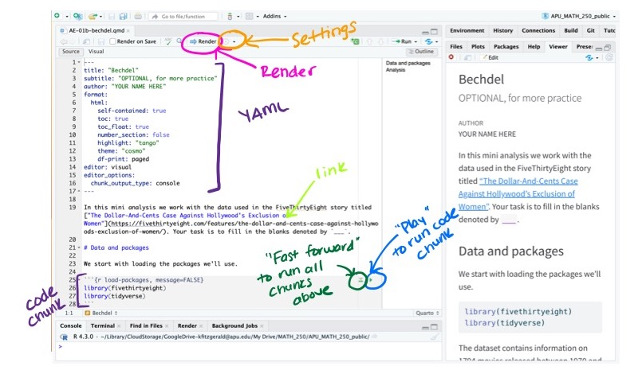

```{r child = "setup.Rmd"}
```

```{r packages, echo=FALSE, message=FALSE, warning=FALSE}
library(tidyverse)
library(viridis)
library(sugrrants)
library(lubridate)
```

## Course toolkit

<br>

.pull-left[
### .gray[Course operation]
.gray[
- nova-stat-4380.netlify.app
- Blackboard
]
]
.pull-right[
### .pink[Doing data science]
- .pink[Programming:]
  - .pink[R]
  - .pink[RStudio]
  - .pink[tidyverse]
  - .pink[Quarto]
]

---

## Learning goals

By the end of the course, you will be able to...

--

- gain insight from data

--
- gain insight from data, **reproducibly**

--
- gain insight from data, reproducibly **(with literate programming)**

--
- gain insight from data, reproducibly (with literate programming), **using modern programming tools and techniques**
---

class: middle

# Reproducible data analysis

---

## Reproducibility checklist

.question[
What does it mean for a data analysis to be "reproducible"?
]

--

Near-term goals:

- Are the tables and figures reproducible from the code and data?
- Does the code actually do what you think it does?
- In addition to what was done, is it clear *why* it was done? 

Long-term goals:

- Can the code be used for other data?
- Can you extend the code to do other things?

---

## Toolkit for reproducibility

- Scriptability $\rightarrow$ R

--

- Literate programming (code, narrative, output in one place) $\rightarrow$ Quarto

--

- Sharability $\rightarrow$ R Projects & GitHub

---

class: middle

# R and RStudio

---

## R and RStudio

.pull-left[
```{r echo=FALSE, out.width="25%"}
knitr::include_graphics("img/r-logo.png")
```
]
.pull-right[
```{r echo=FALSE, out.width="50%"}
knitr::include_graphics("img/rstudio-logo.png")
```
]

- R is an open-source statistical **programming language**
- RStudio is a convenient interface for R called an **IDE** (integrated development environment), e.g. *"I write R code in the RStudio IDE"*
- At its simplest:<sup>*</sup>
    - R is like a car’s engine
    - RStudio is like a car’s dashboard


.footnote[
*Source: [Modern Dive](https://moderndive.com/)
]

---

## R packages

- **Packages** are the fundamental units of reproducible R code. They include reusable R functions, the documentation that describes how to use them, and sample data<sup>1</sup>

- There are over 20,000 R packages available on **CRAN** (the Comprehensive R Archive Network)<sup>2</sup>

- We're going to work with a small (but important) subset of these!

.footnote[
<sup>1</sup> Wickham and Bryan, [R Packages](https://r-pkgs.org/).

<sup>2</sup> [CRAN contributed packages](https://cran.r-project.org/web/packages/).
]

---

## Tour: R and RStudio

```{r echo=FALSE, out.width="80%"}
knitr::include_graphics("img/tour-r-rstudio.png")
```

---

## A short list (for now) of R essentials

- Functions are (most often) verbs, followed by what they will be applied to in parentheses:

```{r eval=FALSE}
do_this(to_this)
do_that(to_this, to_that, with_those)
```

--

- Packages are installed with the `install.packages` function and loaded with the `library` function, once per session:

```{r eval=FALSE}
install.packages("package_name")
library(package_name)
```

---

## R essentials (continued)

- Columns (variables) in data frames are accessed with `$`:

.small[
```{r eval=FALSE}
dataframe$var_name
```
]

--

- Object documentation can be accessed with `?`

```{r eval=FALSE}
?mean
```

---

## tidyverse

.pull-left[
```{r echo=FALSE, out.width="99%"}
knitr::include_graphics("img/tidyverse.png")
```
]

.pull-right[
.center[.large[
[tidyverse.org](https://www.tidyverse.org/)
]]

- The **tidyverse** is an opinionated collection of R packages designed for data science
- All packages share an underlying philosophy and a common grammar
]

---

class: middle

# Quarto

---

## Quarto

.center[.large[
[https://quarto.org/](https://quarto.org/)
]]

- **Quarto** and the various packages that support it enable R users to write their code and prose in reproducible computational documents
    + each time you render, the analysis is run from the beginning
- Quarto documents have a `.qmd` file extension
- Simple markdown syntax for text
- Code goes in chunks, defined by three backticks, narrative goes outside of chunks

---

## Tour: Quarto

```{r echo=FALSE, out.height="100%"}

```

---

## Environments

.tip[
The environment of your Quarto document is separate from the Console!
]

Remember this, and expect it to bite you a few times as you're learning to work 
with Quarto!

---

## Environments

.pull-left[
First, run the following in the console

.small[
```{r eval = FALSE}
x <- 2
x * 3
```
]

.question[
All looks good, eh?
]
]

--

.pull-right[
Then, add the following in an R chunk in your Quarto document

.small[
```{r eval = FALSE}
x * 3
```
]

.question[
What happens? Why the error?
]
]

---

## How will we use Quarto?

- Every assignment / report / project / etc. is a Quarto document
- You'll always have a template Quarto document to start with
- The amount of scaffolding in the template will decrease over the semester

---

## What's with all the hexes?

```{r echo=FALSE, out.width="60%"}
knitr::include_graphics("img/hex-australia.png")
```

.footnote[
Mitchell O'Hara-Wild, [useR! 2018 feature wall](https://www.mitchelloharawild.com/blog/user-2018-feature-wall/)
]

---

.your-turn[
.light-blue[.hand[Your turn: ]] ` AE 01 - UN Votes`
If you haven't already completed AE 01 - UN Votes,
- Go to our [Github repo ](https://github.com/kgfitzgerald/NOVA_STAT_4380/tree/main/assignment_templates) and navigate to AE > AE-01-unvotes.qmd
- Click to "Download raw file"
- Place the downloaded .qmd document in your STAT_4380 folder on your computer
- From inside your STAT_4380 RStudio Project, open and render the Quarto document `AE-01-unvotes.qmd`
- Complete the tasks in the "Try it out!" section
]
