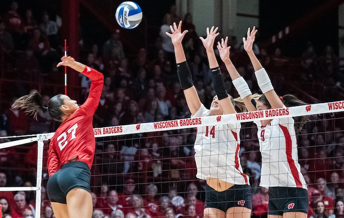
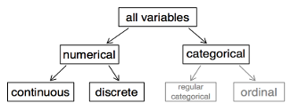

```{r child = "setup.Rmd"}
```

```{r packages, echo=FALSE, message=FALSE, warning=FALSE}
library(tidyverse)
library(ggridges)
```


---

class: middle

# ggplot `r emo::ji("heart")` `r emo::ji("volleyball")`

---

## Data: Volleyball

NCAA women's volleyball season-level statistics for 2022-2023 season.

.pull-left-narrow[
```{r echo=FALSE, out.width="80%"}

```
]
.pull-right-wide[
```{r}
library(tidyverse)
volleyball <- read_csv("./data/volleyball_ncaa_div1_2022_23_clean.csv") 
glimpse(volleyball)
```
]

---

## Number of variables involved

- Univariate data analysis - distribution of single variable
- Bivariate data analysis - relationship between two variables
- Multivariate data analysis - relationship between many variables at once, usually focusing on the relationship between two while conditioning for others

---

## Types of variables

- **Numerical variables** can be classified as **continuous** or **discrete** based on whether or not the variable can take on an infinite number of values or only non-negative whole numbers, respectively.
- If the variable is **categorical**, we can determine if it is **ordinal** based on whether or not the levels have a natural ordering.



---


class: middle

# Visualizing 1 numeric variable

---

## Describing shapes of numerical distributions

- shape:
    - skewness: right-skewed, left-skewed, symmetric (skew is to the side of the longer tail)
    - modality: unimodal, bimodal, multimodal, uniform
- center: mean (`mean`), median (`median`), mode (not always useful)
- spread: range (`range`), standard deviation (`sd`), inter-quartile range (`IQR`)
- unusual observations

---

# 1 numeric variable: histogram

.panelset[
.panel[.panel-name[Plot]
```{r ref.label = "hist", echo = FALSE, out.width = "50%", fig.width = 8}
```
]
.panel[.panel-name[Code]

```{r hist, fig.show = "hide"}
ggplot(volleyball, aes(x = kills_per_set)) +
  geom_histogram(color = "white")
```
]
]

---

## Histograms and binwidth

.panelset[
.panel[.panel-name[binwidth = 0.1]
```{r out.width = "50%"}
ggplot(volleyball, aes(x = kills_per_set)) +
  geom_histogram(color = "white", binwidth = 0.1)
```
]
.panel[.panel-name[binwidth = 0.5]
```{r out.width = "50%"}
ggplot(volleyball, aes(x = kills_per_set)) +
  geom_histogram(color = "white", binwidth = 0.5)
```
]
.panel[.panel-name[binwidth = 1]
```{r out.width = "50%"}
ggplot(volleyball, aes(x = kills_per_set)) +
  geom_histogram(color = "white", binwidth = 1)
```
]
]

---

## 1 numeric variable: Density plot

```{r}
ggplot(volleyball, aes(x = kills_per_set)) +
  geom_density()
```

---

## Density plots and adjusting bandwidth

.panelset[
.panel[.panel-name[adjust = 0.5]
```{r out.width = "50%"}
ggplot(volleyball, aes(x = kills_per_set)) +
  geom_density(adjust = 0.5)
```
]
.panel[.panel-name[adjust = 1]
```{r out.width = "50%"}
ggplot(volleyball, aes(x = kills_per_set)) +
  geom_density(adjust = 1) # default bandwidth
```
]
.panel[.panel-name[adjust = 2]
```{r out.width = "50%"}
ggplot(volleyball, aes(x = kills_per_set)) +
  geom_density(adjust = 2)
```
]
]
---

## 1 numeric variable: Box plot

```{r}
ggplot(volleyball, aes(x = kills_per_set)) +
  geom_boxplot()
```

---

## Customizing box plots

.panelset[
.panel[.panel-name[Plot]
```{r ref.label = "box-custom", echo = FALSE, warning = FALSE}
```
]
.panel[.panel-name[Code]
```{r box-custom, fig.show = "hide", warning = FALSE}
ggplot(volleyball, aes(x = kills_per_set)) +
  geom_boxplot() +
  labs(
    x = "Kills per set",
    y = NULL,
    title = "Kills per set is left-skewed with a median around 12.5"
  ) +
  theme( #<<
    axis.ticks.y = element_blank(), #<<
    axis.text.y = element_blank() #<<
  ) #<<
```
]
]

---

class: middle

# Visualizing 1 numeric + 1 categorical variable

---

# Faceted histograms

.panelset[
.panel[.panel-name[Plot]
```{r ref.label = "facet_hist", echo = FALSE, out.width = "50%", fig.width = 8}
```
]
.panel[.panel-name[Code]

```{r facet_hist, fig.show = "hide"}
ggplot(volleyball, aes(x = kills_per_set)) +
  geom_histogram(color = "white", binwidth = 1) +
  facet_wrap(~ region)
```
]
]

---

## Overlapping densities

.panelset[
.panel[.panel-name[Plot]
```{r ref.label = "o_dens", echo = FALSE, out.width = "50%", fig.width = 8}
```
]
.panel[.panel-name[Code]

```{r o_dens, fig.show = "hide"}
ggplot(volleyball, aes(x = kills_per_set, 
                       fill = region,
                       color = region)) +
  geom_density(alpha = 0.3)
```
]
]


---

## Ridge plots

.panelset[
.panel[.panel-name[Plot]
```{r ref.label = "ridge", echo = FALSE, out.width = "50%", fig.width = 8}
```
]
.panel[.panel-name[Code]

```{r ridge, fig.show = "hide"}
ggplot(volleyball, aes(x = kills_per_set, 
                       y = region)) +
  geom_density_ridges()
```
]
]

---

## Side-by-side Box plots

```{r}
ggplot(volleyball, aes(x = kills_per_set, y = region)) +
  geom_boxplot()
```

---

## Side-by-side violin plots

```{r}
ggplot(volleyball, aes(x = kills_per_set, y = region)) +
  geom_violin()
```

---

class: middle

# Visualizing 1 categorical variable

---

# 1 categorical variable: bar plot

.panelset[
.panel[.panel-name[color]
```{r out.width = "50%"}
ggplot(volleyball, aes(y = conference)) +
  geom_bar(color = "navyblue")
```
]
.panel[.panel-name[fill]
```{r out.width = "50%"}
ggplot(volleyball, aes(y = conference)) +
  geom_bar(fill = "navyblue")
```
]
.panel[.panel-name[both]
```{r out.width = "50%"}
ggplot(volleyball, aes(y = conference)) +
  geom_bar(fill = "navyblue", color = "pink")
```
]
]

---


class: middle

# 2 categorical variables

---

# 2 categorical variables: stacked bar plot

.panelset[
.panel[.panel-name[Plot]
```{r ref.label = "two-cat-stacked", echo = FALSE, warning = FALSE, out.width = "70%", fig.width = 8}
```
]
.panel[.panel-name[Code]

```{r two-cat-stacked, fig.show = "hide"}
ggplot(volleyball, aes(y = conference, fill = winning_season)) +
  geom_bar()
```
]
]

---

# 2 categorical: standardized bar plot

.panelset[
.panel[.panel-name[Plot]
```{r ref.label = "two-cat-standardized", echo = FALSE, warning = FALSE, out.width = "70%", fig.width = 8}
```
]
.panel[.panel-name[Code]

```{r two-cat-standardized, fig.show = "hide"}
ggplot(volleyball, aes(y = conference, fill = winning_season)) +
  geom_bar(position = "fill") +
  labs(x = "proportion")
```
]
]

---


class: middle

# 2 numeric variables

---


# 2 numeric variables: scatterplot

.panelset[
.panel[.panel-name[Plot]
```{r ref.label = "scatter", echo = FALSE, warning = FALSE, out.width = "70%", fig.width = 8}
```
]
.panel[.panel-name[Code]

```{r scatter, fig.show = "hide"}
ggplot(volleyball, aes(x = digs_per_set, y = kills_per_set)) +
  geom_point()
```
]
]

---

# 2 numeric variables: hexplot

.panelset[
.panel[.panel-name[Plot]
```{r ref.label = "hex", echo = FALSE, warning = FALSE, out.width = "70%", fig.width = 8}
```
]
.panel[.panel-name[Code]

```{r hex, fig.show = "hide"}
ggplot(volleyball, aes(x = digs_per_set, y = kills_per_set)) +
  geom_hex()
```
]
]

---

# More than 2: scatterplot w/ color

.panelset[
.panel[.panel-name[Plot]
```{r ref.label = "two-plus", echo = FALSE, warning = FALSE, out.width = "70%", fig.width = 8}
```
]
.panel[.panel-name[Code]

```{r two-plus, fig.show = "hide"}
ggplot(volleyball, aes(x = hitting_pctg, y = opp_hitting_pctg,
                        color = win_pctg)) +
  geom_point()
```
]
]

---

# More than 2: faceted scatterplot w/ color

.panelset[
.panel[.panel-name[Plot]
```{r ref.label = "four", echo = FALSE, warning = FALSE, out.width = "70%", fig.width = 8}
```
]
.panel[.panel-name[Code]

```{r four, fig.show = "hide"}
ggplot(volleyball, aes(x = hitting_pctg, y = opp_hitting_pctg,
                       color = win_pctg)) +
  geom_point() +
  facet_wrap(~region)
```
]
]

---

# And many more!

- [Directory of visualizations](https://clauswilke.com/dataviz/directory-of-visualizations.html)

- [The R Graph Gallery](https://r-graph-gallery.com)