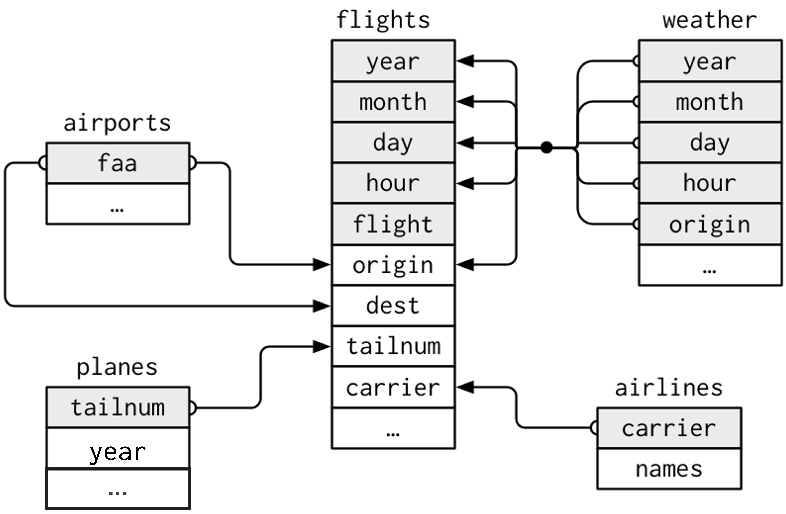
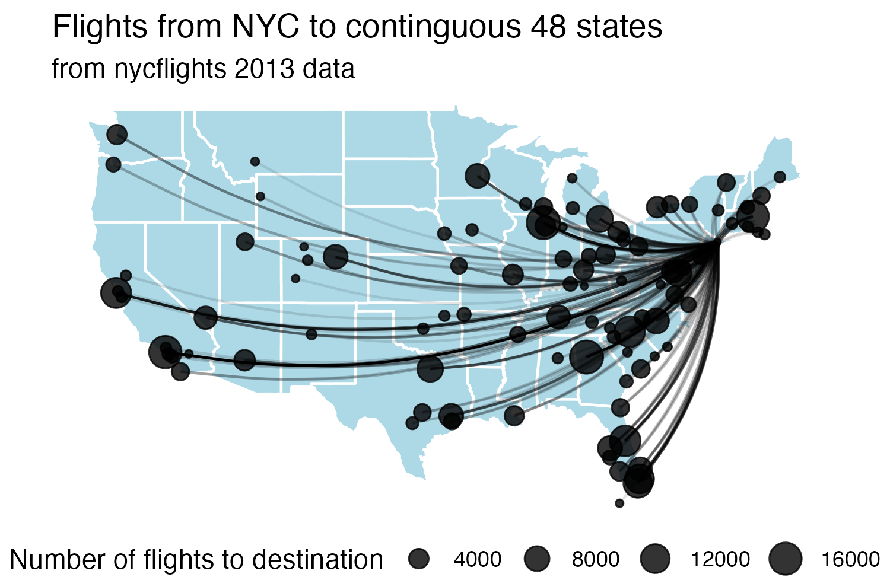

```{r child = "setup.Rmd"}
```

```{r packages, echo=FALSE, message=FALSE, warning=FALSE}
library(tidyverse)
library(knitr)
library(scales)
library(kableExtra)
library(dsbox)
options(
  dplyr.print_min = 10, 
  dplyr.print_max = 10
  )
```


# A quick refresh of `dplyr` verbs in R

Which of the following allows you to keep rows that meet a certain criteria?

  A. `keep()`
  
  B. `where()`
  
  C. `filter()`
  
  D. `select()`
  
  E. `mutate()`

---

# A quick refresh of `dplyr` verbs in R

Which of the following allows you to keep specified columns?

  A. `keep()`
  
  B. `colname()`
  
  C. `filter()`
  
  D. `select()`
  
  E. `mutate()`

---

# A quick refresh of `dplyr` verbs in R

Think back to the `midwest` dataset you we used previously (dimensions: 437 x 2), where each row is a `county`, and there is data on counties from 5 Midwestern states.

How many rows and columns will the following code produce?

```{r, eval = FALSE}
midwest |> count(state)
```

A. 437 x 3

B. 5 x 2

C. 1 x 1

D. 5 x 28


---

# Still thinking about the `midwest` data...

You want to calculate the average percentage of college-educated adults (`percollege`) by state.
Which verbs do you need?

A. `filter()` and `mutate()`

B. `group_by()` and `summarize()`

C. `mutate()` and `arrange()`

D. `count()` and `summarize()`

---

# Still thinking about the `midwest` data...

You want to keep only counties where less than 10% of the population lives in poverty `(percbelowpoverty)` .
Which verb do you use?

A. `mutate()`

B. `filter()` 

C. `group_by()`

D. `summarize()`

---

# Still thinking about the `midwest` data...

You want to create a new variable for the proportion of children in the population, using
`perc_child = popchild / poptotal`.
 Which verb should you use?

A. `summarize()`

B. `filter()`

C. `mutate()` 

D. `count()`

---

# Still thinking about the `midwest` data...

How many rows will the resulting dataset have?
```{r, eval = FALSE}
midwest |> 
  group_by(state) |> 
  mutate(mean_poverty = mean(percbelowpoverty))
```

A. One per state

B. One per value of `percbelowpoverty`

C. Same number as the original dataset

D. Depends on missing values

---

# Still thinking about the `midwest` data...

You want to find out which state has the highest average percentage of people in poverty. Which pipeline would give you that result?

```{r, eval = FALSE}
#A
midwest |> summarize(max(percbelowpoverty))

#B
midwest |> 
      group_by(state) |> 
      summarize(avg_pov = mean(percbelowpoverty)) |> 
      arrange(desc(avg_pov))

#C
midwest |> mutate(avg_pov = mean(percbelowpoverty)) |> max()

#D 
midwest |> count(percbelowpoverty) |> arrange()
```

---

# Your turn: AE-04

Recall: `flights` contains data about every flight that departed La Guardia, JFK, or Newark airports in 2013

```{r fig-nycflights13, echo=FALSE, out.width='60%'}


```


Exercises 1 - 5

---

# How could we create this? 

.pull-left[

In groups, brainstorm the data wrangling required to create this visualizaton. 

+ What does the data need to look like? What does one row of the data represent? What columns do you need? Sketch out a few "dummy" rows of what you expect the data to contain.
+ Which of the above columns already exist (in which datasets), and which ones need to be created? 
+ What joining and/or aggregation steps need to take place? Write some psuedocode for this.
]

.pull-right[


]

