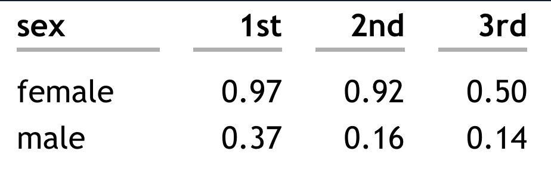

```{r child = "setup.Rmd"}
```

```{r packages, echo=FALSE, message=FALSE, warning=FALSE}
library(tidyverse)
library(knitr)
library(scales)
library(kableExtra)
library(dsbox)
library(titanic)
options(
  dplyr.print_min = 10, 
  dplyr.print_max = 10
  )
```

# Goals

Today we will practice: 

+ pivoting data frames to wide or long format
+ planning a data wrangling pipeline to accomplished a desired task/visualization
+ computing (conditional) proportions using `dplyr` verbs


---

class: middle

# Case study: Grocery sales

---

## Grocery sales

- Have:
  <!-- - Purchases: One row per customer per item, listing purchases they made -->
  - Customers: one row per customer, and a column for each item they purchased
  - Prices: one row per item in the store, listing their prices
- Want: one row per customer per item
  - How much revenue was brought in per item (e.g. milk)? 
  - How much was spent per person? 
  - How much total revenue was brought into the store?

--

```{r include=FALSE}
purchases <- read_csv("data/sales/purchases.csv")
prices <- read_csv("data/sales/prices.csv")
customers <- read_csv("data/sales/customers.csv")
```

.pull-left[
```{r message = FALSE}
customers
```
]
.pull-right[
```{r message = FALSE}
prices
```
]

---


class: middle

# .hand[We...]

.huge[.green[have]] .hand[data organised in an unideal way for our analysis]

.huge[.pink[want]] .hand[to reorganise the data to carry on with our analysis]

---

## Data: Sales


<br>

.pull-left[
### .green[We have...]
```{r echo=FALSE}
customers
```
]

--
.pull-right[
### .pink[We want...]
```{r echo=FALSE}
customers |>
  pivot_longer(cols = item_1:item_3, names_to = "item_no", values_to = "item")
```
]

---

## A grammar of data tidying

.pull-left[
```{r dplyr-part-of-tidyverse, echo=FALSE, out.width="60%", caption = "tidyr is part of the tidyverse"}
include_graphics("img/tidyr-part-of-tidyverse.png")
```
]
.pull-right[
The goal of tidyr is to help you tidy your data via

- pivoting for going between wide and long data
- splitting and combining character columns
- nesting and unnesting columns
- clarifying how `NA`s should be treated
]

---

class: middle

# Pivoting data

---

## Not this...

```{r echo=FALSE,out.width="70%"}
include_graphics("img/pivot.gif")
```

---

## but this!

.center[
```{r echo=FALSE, out.width="45%", out.extra ='style="background-color: #FDF6E3"'}
include_graphics("img/tidyr-longer-wider.gif")
```
]

---

## Wider vs. longer

.pull-left[
### .green[wider]
more columns
```{r echo=FALSE}
customers
```
]

--
.pull-right[
### .pink[longer]
more rows
```{r echo=FALSE}
customers |>
  pivot_longer(cols = item_1:item_3, names_to = "item_no", values_to = "item")
```
]

---

## `pivot_longer()`

.pull-left[
- `data` (as usual)
]
.pull-right[
```{r eval=FALSE}
pivot_longer(
  data, #<<
  cols, 
  names_to = "name", 
  values_to = "value"
  )
```
]

---

## `pivot_longer()`

.pull-left[
- `data` (as usual)
- `cols`: columns to pivot into longer format 
]
.pull-right[
```{r eval=FALSE}
pivot_longer(
  data, 
  cols, #<<
  names_to = "name", 
  values_to = "value"
  )
```
]

---

## `pivot_longer()`

.pull-left[
- `data` (as usual)
- `cols`: columns to pivot into longer format 
- `names_to`: name of the column where column names of pivoted variables go (character string)
]
.pull-right[
```{r eval=FALSE}
pivot_longer(
  data, 
  cols, 
  names_to = "name", #<<
  values_to = "value"
  )
```
]

---

## `pivot_longer()`

.pull-left[
- `data` (as usual)
- `cols`: columns to pivot into longer format 
- `names_to`: name of the column where column names of pivoted variables go (character string)
- `values_to`: name of the column where data in pivoted variables go (character string)
]
.pull-right[
```{r eval=FALSE}
pivot_longer(
  data, 
  cols, 
  names_to = "name", 
  values_to = "value" #<<
  )
```
]

---

## Customers $\rightarrow$ purchases

```{r}
purchases <- customers |>
  pivot_longer( #<<
    cols = item_1:item_3,  # variables item_1 to item_3 #<<
    names_to = "item_no",  # column names -> new column called item_no #<<
    values_to = "item"     # values in columns -> new column called item #<<
    ) #<<

purchases
```

---

## Why pivot?

Most likely, because the next step of your analysis needs it

--

.pull-left[
```{r}
prices
```
]
.pull-right[
```{r}
purchases |>
  left_join(prices) #<<
```
]

---

## Grocery sales

.panelset[

.panel[.panel-name[Total revenue]
.pull-left[
```{r}
purchases |> 
  left_join(prices) #<<
```
]
.pull-right[
```{r}
purchases |> 
  left_join(prices) |>
  summarise(total_revenue = sum(price)) #<<
```
]
]

.panel[.panel-name[Revenue per customer]

.pull-left[
```{r}
purchases |> 
  left_join(prices)
```
]
.pull-right[
```{r}
purchases |> 
  left_join(prices) |>
  group_by(customer_id) |> #<<
  summarise(total_revenue = sum(price))
```
]

]

]

---

## Purchases $\rightarrow$ customers

.pull-left-narrow[
- `data` (as usual)
- `names_from`: which column in the long format contains the what should be column names in the wide format
- `values_from`: which column in the long format contains the what should be values in the new columns in the wide format
]
.pull-right-wide[
```{r}
purchases |>
  pivot_wider( #<<
    names_from = item_no, #<<
    values_from = item #<<
  ) #<<
```
]

---

class: middle

# Case study: Approval rating of Donald Trump

---

```{r echo=FALSE, out.width="70%"}
knitr::include_graphics("img/trump-approval.png")
```

.footnote[
Source: [FiveThirtyEight](https://projects.fivethirtyeight.com/trump-approval-ratings/adults/)
]

---

## Goal

```{r include=FALSE}
trump <- read_csv("data/trump/trump.csv")
```

Write psuedocode required to create this visualization

```{r echo=FALSE, out.width="80%"}
trump |>
  pivot_longer(
    cols = c(approval, disapproval),
    names_to = "rating_type",
    values_to = "rating_value"
  ) |>
  ggplot(aes(x = date, y = rating_value, 
             color = rating_type, group = rating_type)) +
  geom_line() +
  facet_wrap(~ subgroup) +
  scale_color_manual(values = c("darkgreen", "orange")) + 
  labs( 
    x = "Date", y = "Rating", 
    color = NULL, 
    title = "How (un)popular is Donald Trump?", 
    subtitle = "Estimates based on polls of all adults and polls of likely/registered voters", 
    caption = "Source: FiveThirtyEight modeling estimates" 
  ) + 
  theme_minimal() +
  theme(legend.position = "bottom")
```


---

## Data

.pull-left-wide[

```{r}
trump
```

]

--

.pull-right-narrow[
**Aesthetic mappings:**  
`r emo::ji("check")`  x = `date`  
`r emo::ji("x")`      y = `rating_value`  
`r emo::ji("x")`      color = `rating_type`

**Facet:**  
`r emo::ji("check")`  `subgroup` (Adults and Voters)
]

---

## Goal

```{r echo=FALSE, out.width="100%"}
trump |>
  pivot_longer(
    cols = c(approval, disapproval),
    names_to = "rating_type",
    values_to = "rating_value"
  ) |>
  ggplot(aes(x = date, y = rating_value, 
             color = rating_type, group = rating_type)) +
  geom_line() +
  facet_wrap(~ subgroup) +
  scale_color_manual(values = c("darkgreen", "orange")) + 
  labs( 
    x = "Date", y = "Rating", 
    color = NULL, 
    title = "How (un)popular is Donald Trump?", 
    subtitle = "Estimates based on polls of all adults and polls of likely/registered voters", 
    caption = "Source: FiveThirtyEight modeling estimates" 
  ) + 
  theme_minimal() +
  theme(legend.position = "bottom")
```


---

## Pivot

```{r output.lines=11}
trump_longer <- trump |>
  pivot_longer(
    cols = c(approval, disapproval),
    names_to = "rating_type",
    values_to = "rating_value"
  )

trump_longer
```

---

## Plot

```{r fig.asp = 0.5}
ggplot(trump_longer, 
       aes(x = date, y = rating_value, color = rating_type, group = rating_type)) +
  geom_line() +
  facet_wrap(~ subgroup)
```

---

.panelset[

.panel[.panel-name[Code]
```{r "trump-plot", fig.show="hide"}
ggplot(trump_longer, 
       aes(x = date, y = rating_value, 
           color = rating_type, group = rating_type)) +
  geom_line() +
  facet_wrap(~ subgroup) +
  scale_color_manual(values = c("darkgreen", "orange")) + #<<
  labs( #<<
    x = "Date", y = "Rating", #<<
    color = NULL, #<<
    title = "How (un)popular is Donald Trump?", #<<
    subtitle = "Estimates based on polls of all adults and polls of likely/registered voters", #<<
    caption = "Source: FiveThirtyEight modeling estimates" #<<
  ) #<<
```
]

.panel[.panel-name[Plot]
```{r ref.label="trump-plot", echo = FALSE, out.width="75%"}
```
]

]

---

.panelset[

.panel[.panel-name[Code]
```{r "trump-plot-2", fig.show="hide"}
ggplot(trump_longer, 
       aes(x = date, y = rating_value, 
           color = rating_type, group = rating_type)) +
  geom_line() +
  facet_wrap(~ subgroup) +
  scale_color_manual(values = c("darkgreen", "orange")) + 
  labs( 
    x = "Date", y = "Rating", 
    color = NULL, 
    title = "How (un)popular is Donald Trump?", 
    subtitle = "Estimates based on polls of all adults and polls of likely/registered voters", 
    caption = "Source: FiveThirtyEight modeling estimates" 
  ) + 
  theme_minimal() + #<<
  theme(legend.position = "bottom") #<<
```
]

.panel[.panel-name[Plot]
```{r ref.label="trump-plot-2", echo = FALSE, out.width="75%", fig.width=6}
```
]

]

---

class: middle

# Deeper dive into counts and proportions with `group_by()`, `count()`, and `summarize()`


---

## Case study: The Titanic

The `titanic` package contains data on 891 passengers aboard the Titanic. 

```{r, echo = FALSE}
glimpse(titanic_train)
```

---

## Case study: The Titanic

We will consider three categorical variables in particular: `survived`, `sex`, and `class`. 

```{r}
titanic_df <- titanic::titanic_train |>
  select(
    survived = Survived,
    sex      = Sex,
    class    = Pclass
  ) |>
  mutate(
    survived = if_else(survived == 1, "Survived", "Died"),
    class    = factor(class, labels = c("1st", "2nd", "3rd"))
  )

glimpse(titanic_df)
```

---

## What does group_by() do?

`group_by()` takes an existing data frame and converts it into a grouped data frame where subsequent operations are performed "once per group"

.pull-left[
```{r}
titanic_df
```
]
.pull-right[
```{r}
titanic_df |> 
  group_by(sex)
```
]

---

## What does group_by() not do?

`group_by()` does not sort the data, `arrange()` does

.pull-left[
```{r}
titanic_df |> 
  group_by(sex)
```
]
.pull-right[
```{r}
titanic_df |> 
  arrange(sex)
```
]

---

## What does group_by() not do?

`group_by()` does not create frequency tables, `count()` does

.pull-left[
```{r}
titanic_df |> 
  group_by(sex)
```
]
.pull-right[
```{r}
titanic_df |> 
  count(sex)
```
]


---

## count() is a short-hand

`count()` is a short-hand for `group_by()` and then `summarise()` to count the number of observations in each group

.pull-left[
```{r}
titanic_df |>
  group_by(sex) |>
  summarise(n = n()) 
```
]
.pull-right[
```{r}
titanic_df |>
  count(sex)
```
]

---

# Adding on `mutate()` for proportions

.pull-left[
```{r}
titanic_df |>
  group_by(sex) |>
  summarise(n = n())  |> 
  mutate(prop = n/sum(n))
```
]
.pull-right[
```{r}
titanic_df |>
  count(sex) |> 
  mutate(prop = n/sum(n))
```
]

---

## count can take multiple arguments

.pull-left[
```{r}
titanic_df |>
  group_by(sex, survived) |>
  summarise(n = n()) 
```
]
.pull-right[
```{r}
titanic_df |>
  count(sex, survived)
```
]

---

# Notice the difference

- `count()` ungroups after itself
- `summarise()` peels off one layer of grouping by default

.pull-left[
```{r}
titanic_df |>
  group_by(sex, survived) |>
  summarise(n = n())  |> 
  mutate(prop = n/sum(n))
```
]
.pull-right[
```{r}
titanic_df |>
  count(sex, survived) |> 
  mutate(prop = n/sum(n))
```

```{r, eval = FALSE}
titanic_df |>
  count(sex, survived) |> 
  group_by(sex) |> 
  mutate(prop = n/sum(n))
```
]

---

## Undo grouping with ungroup()

.pull-left[
```{r}
titanic_df |>
  count(sex, survived) |> 
  group_by(sex) |> 
  mutate(prop = n/sum(n))
```
]

.pull-right[
```{r}
titanic_df |>
  count(sex, survived) |> 
  group_by(sex) |> 
  mutate(prop = n/sum(n)) |> 
  ungroup()
```
]
---

## Grouping by more than one variable

```{r}
titanic_df |> 
  count(class, sex, survived) |> 
  group_by(sex, class) |> 
  mutate(prop = n/sum(n))
```

---

## If you only need one category

.pull-left[
```{r}
titanic_df |> 
  group_by(class, sex) |> 
  summarize(prop_survived = sum(survived == "Survived")/n())
```
]
.pull-right[
```{r}
titanic_df |> 
  count(class, sex, survived) |> 
  group_by(sex, class) |> 
  mutate(prop = n/sum(n)) |> 
  filter(survived == "Survived")
```
]

---

## Displaying in wide format

```{r}
titanic_df |> 
  group_by(class, sex) |> 
  summarize(prop_survived = sum(survived == "Survived")/n()) |> 
  pivot_wider(names_from = class,
              values_from = prop_survived)
```

---

## Cleaning up with `kableExtra`

```{r, eval = FALSE}
titanic_df |> 
  group_by(class, sex) |> 
  summarize(prop_survived = sum(survived == "Survived")/n()) |> 
  pivot_wider(names_from = class,
              values_from = prop_survived) |> 
  kbl(digits = 2) |> 
  kable_minimal()
```

```{r kable-image, echo=FALSE, out.width="60%"}

```


