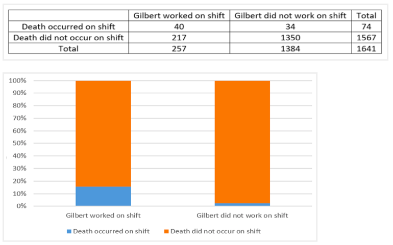
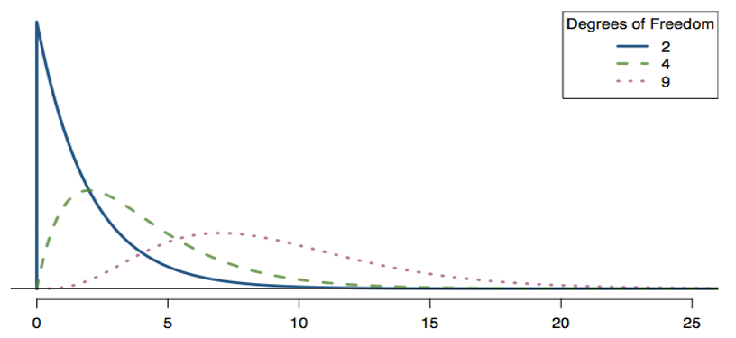

```{r child = "setup.Rmd"}
```

```{r packages, echo = FALSE, message=FALSE, warning=FALSE}
library(tidyverse)
library(kableExtra)
library(dsbox)
library(scales)
library(infer)
library(distributional)
library(ggdist)
library(DescTools)
library(readxl)
```

---

class: middle

# Case study: Is Kristen Gilbert a serial killer?

---

## Case study: Is Kristen Gilbert a serial killer?


```{r, echo = FALSE}

```

---

## Case study: Is Kristen Gilbert a serial killer?

Proportions aren't close to 0.5, odds ratio is more appropriate here.

```{r}
gilbert <- matrix(c(40, 34, 217, 1350), 
                  nrow = 2, byrow = TRUE)
gilbert
OddsRatio(gilbert, conf.level = 0.99)
```

---

## Hypothesis tests for two-way tables (Chi-squared test)

.pull-left[
$$H_0: \text{two variables are independent}$$
$$H_A: \text{two variables are NOT independent}$$
How many deaths would we expect in each column if $H_0$ is true?

```{r}
baseline_risk <- 74/1641 
baseline_risk*257 #gilbert shifts
baseline_risk*1384 #non-gilbert shifts
```


]
.pull-right[
```{r, echo = FALSE}

```
]

---

## Expected vs. Observed Counts

In general, we can compute the expected counts for the $i^{th}$ row and $j^{th}$ column by:

$$\text{Expected Count}_{\text{row i, col j}} = \frac{\text{(row i total) x (column j total)}}{\text{table total}}$$

```{r, echo = FALSE}
kable(matrix(c("Death occured", "40   (11.59)", "34   (62.4)", "74",
         "Death did NOT occur", "217   (245.4)", "1350   (1321.6)", "1567",
         "Total","257", "1384", "1641"), 
                  nrow = 3, byrow = TRUE), 
      col.names = c("", "Gilbert worked", "Gilbert did NOT work", "Total"))

```

---

## Chi-square test-statistic

.pull-left[
Want some way to summarize how far off observed counts are from expected counts

$$X^2 = \sum_{k = 1}^K \frac{(O - E)^2}{E},$$
+ K is the number of cells (in this case 4)

Note: when independent, $O \approx E$, so we expect $X^2$ to be small when $H_0$ is true.
]
.pull-right[
```{r, echo = FALSE}
kable(matrix(c("Death occured", "40   (11.59)", "34   (62.4)", "74",
         "Death did NOT occur", "217   (245.4)", "1350   (1321.6)", "1567",
         "Total","257", "1384", "1641"), 
                  nrow = 3, byrow = TRUE), 
      col.names = c("", "Gilbert worked", "Gilbert did NOT work", "Total"))
```


$$\begin{aligned}
X^2_1 &= \frac{(40 - 11.59)^2}{11.59} + \frac{(34 - 62.4)^2}{62.4} \\
&+ \frac{(217 - 245.4)^2}{245.4} + \frac{(1350 - 1321.6)^2}{1321.6} \\
&= 86.5
\end{aligned}$$

]

---

## Chi-square test-statistic

Statistical theory tells us that when $H_0$ is true, 

$$X^2 =\sum_{k = 1}^K \frac{(O - E)^2}{E} \sim\chi^2_{df},$$

where $df = (I - 1)(J - 1)$, I = # of rows, J = # of columns (in this case df = 1)

```{r, echo = FALSE}

```

---

## Compare observed statistic to chi-square distribution

.pull-left[
For the Kristen Gilbert data, $X^2 = 86.5$

Critical value for $\alpha = 0.01$:

```{r}
qchisq(0.99, df = 1)
```

Because 86.5 > 6.63, there is sufficient evidence to REJECT H0 and claim that shifts Gilbert worked and whether a death occured are NOT independent. 

What will our p-value be?

]

.pull-right[

```{r, echo = FALSE}
stat <- 86.5
crit_value99 <- qchisq(.99, df = 1)
ggplot() +
  xlim(c(-20,110)) + 
  stat_slab(aes(y = "X^2",
                   dist = dist_chisq(df = 1),
                   fill = after_stat(x > stat)),
               show.legend = FALSE) +
  geom_vline(xintercept = crit_value99, linewidth = 1, linetype = 21,
             color = "navyblue") +
  annotate("label", label = "0.01 Critical\nValue", 
           x = crit_value99, y = 2, color = "navyblue") +
    geom_vline(xintercept = stat, linewidth = 1, linetype = 19,
             color = "purple") +
  annotate("label", label = "Test\nStatistic", 
           x = stat, y = 2.25, color = "purple") +
  coord_cartesian(expand = FALSE, ylim = c(0.9, 2.5)) +
  labs(y = "", x = "x") +
  scale_fill_viridis_d() +
  theme_minimal()
```

**Assumptions?** Independence, large sample (at least 5 expected counts in each cell)

]

---

## Chi-squared test in R

```{r}
gilbert
chisq.test(gilbert)
```

Note: Yates' continuity correction is used. Set `correct = FALSE` to match our by-hand calculation (though in general, keep continuity correction on). 

---

## Chi-squared test in R (with raw data)

```{r, echo = FALSE}
gilbert_raw <- data.frame(shift = c(rep("Gilbert", 40), rep("Not Gilbert", 34),
                                    rep("Gilbert", 217), rep("Not Gilbert", 1350)),
                          death = c(rep("death", 74), rep("no death", 1567)))
```

```{r}
glimpse(gilbert_raw)

chisq_test(gilbert_raw, response = death, explanatory = shift)
```

CONCLUSION: We REJECT H0. That is, we have sufficient evidence to claim that the deaths were NOT independent of whether or not Kristen Gilbert was working the shift. That is, this is evidence in favor of her being a serial killer. 

---

## Couldn't I have just used `prop_test()`?

```{r, warning = FALSE}
prop_test(gilbert_raw, response = death, explanatory = shift)

prop_test(gilbert_raw, response = death, explanatory = shift, z = TRUE)
```

---

## When to use `prop_test()` vs. `chisq_test()`

+ A chi-squared test is the more general/flexible option that works for any two-way table
+ Difference in proportions only appropriate with two-level categorical variables
+ Use difference in proportions if your research question truly is an estimation question, rather than a hypothesis test question

---

class: middle

# Case study: Disaggregating Asian American tobacco use

---

## Case study: tobacco use

Understanding cultural differences in tobacco use across different demographic groups can lead to improved health care education and treatment. A recent study disaggregated tobacco use across Asian American ethnic groups including Asian-Indian (n = 4,373), Chinese (n = 4,736), and Filipino (n = 4,912). The number of current smokers in each group was reported as Asian-Indian (n = 223), Chinese (n = 279), and Filipino (n = 609). (Rao et al. 2021)

In order to assess whether there is a difference in current smoking rates across three Asian American ethnic groups, the observed data is compared to the data that would be expected if there were no association between the variables.

```{r}
tobacco <- matrix(c(4150, 223, 
                    4457, 279, 
                    4303, 609), 
                  nrow = 3, byrow = TRUE)
```

---

## Case study: tobacco use

**Research question:** is there a difference in current smoking rates across three Asian American ethnic groups? In other words, are smoking rates and ethnic group independent?

--

**How many variables?** 2

**What type of variables?** Categorical, more than two levels

--

This is a hypothesis test question, and a chi-square test is appropriate.

**Assumptions?** Independence, at least 5 expected counts per cell

---

## Chi-square test

$$H_0: \text{smoking rates are the same for each ethnic group (two variables indep.)}$$

$$H_A: \text{smoking rates are NOT the same for each ethnic group (two variables NOT indep.)}$$

```{r}
chisq.test(tobacco)
qchisq(.99, 2)
```

There is sufficient evidence to REJECT H0 and claim smoking rates differ by ethnic group (they are NOT independent).

---

## Chi-square test

```{r, echo = FALSE}
stat <- 209.42
crit_value99 <- qchisq(.99, df = 2)
ggplot() +
  xlim(c(-20,250)) + 
  stat_slab(aes(y = "X^2",
                   dist = dist_chisq(df = 2),
                   fill = after_stat(x > stat)),
               show.legend = FALSE) +
  geom_vline(xintercept = crit_value99, linewidth = 1, linetype = 21,
             color = "navyblue") +
  annotate("label", label = "0.01 Critical\nValue", 
           x = crit_value99, y = 2, color = "navyblue") +
    geom_vline(xintercept = stat, linewidth = 1, linetype = 19,
             color = "purple") +
  annotate("label", label = "Test\nStatistic", 
           x = stat, y = 2.25, color = "purple") +
  coord_cartesian(expand = FALSE, ylim = c(0.9, 2.5)) +
  labs(y = "", x = "x") +
  scale_fill_viridis_d() +
  theme_minimal()
```

---

## Descriptive analysis to contextualize

A recent study disaggregated tobacco use across Asian American ethnic groups including Asian-Indian (n = 4,373), Chinese (n = 4,736), and Filipino (n = 4,912). The number of current smokers in each group was reported as Asian-Indian (n = 223), Chinese (n = 279), and Filipino (n = 609). (Rao et al. 2021)

```{r}
prop.table(tobacco, margin = 1)
```

---

## Recap

```{r, echo = FALSE, warning = FALSE, message = FALSE}
tab <- read_excel("./data/recap.xlsx", sheet = "categorical",
                  col_types = "text")

tab <- tab %>% mutate(across(everything(), ~ gsub("'", "", .)))

kable(tab, escape = FALSE, format = "html") %>%
  kable_styling("striped", full_width = FALSE)

```


